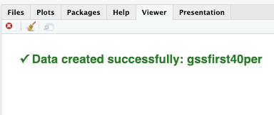
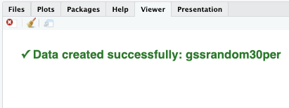
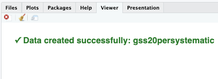

# Module items  { data-readaloud-exclude }
## R Script file code { data-readaloud-exclude }
- :lucide-clipboard-copy: [[Copy the code]] below ➜ Paste into [[RStudio console]] ➜ Hit ++enter++  
    - ```r
    source(url("https://raw.githubusercontent.com/ttezcann/ssric-reg/refs/heads/main/docs/assets/attachments/data/0-packages-data.R")); 
    (function(f="08-sampling.R"){if(!file.exists(f)){download.file("https://raw.githubusercontent.com/ttezcann/ssric-reg/refs/heads/main/docs/assets/attachments/modules/08.-probabilistic-sampling/08-sampling.R",f,mode="wb");file.edit(f)}else{download.file("https://raw.githubusercontent.com/ttezcann/ssric-reg/refs/heads/main/docs/assets/attachments/modules/08.-probabilistic-sampling/08-sampling.R",gsub(".R","-original.R",f),mode="wb");file.edit(gsub(".R","-original.R",f))}})()
    ```
        - When this R script file opens in a new tab, [[Save R script file|save your previous R script file(s)]], and 
            - Close the previous tabs (R Script files), which you can find later in the [[Files tab]].

## Assignment  { data-readaloud-exclude }
- [Sampling :lucide-download:](https://docs.google.com/document/d/1alOw1J_m55H9k8J8yugvvouaWcD4soAT?rtpof=true&usp=drive_fs){ .md-button .md-button--primary target="_blank" rel="noopener" }
    - See: [[How to submit an assignment]]

### Sample assignment  { data-readaloud-exclude }
- [Sample: Sampling :lucide-download:](https://docs.google.com/document/d/1ahNviJmwy8vj50Y0faEW1r5gJ4TD70Jp?rtpof=true&usp=drive_fs){ .md-button .md-button--primary target="_blank" rel="noopener" }

## Suggested reading  { data-readaloud-exclude }
<div class="grid cards" markdown>
- :lucide-book-open:  
[Aldridge, Alan, and Kenneth Levine. 2001. “Selecting Samples.” Pp. 61–82 in Surveying the social world: principles and practice in survey research, Understanding social research. Buckingham: Philadelphia, PA: Open University Press.](https://drive.google.com/open?id=1zvNjowBr8HWuvQyF69qlrmPyGewKlHT3&usp=drive_fs){target="_blank" rel="noopener"}
</div>

<!-- slide-break -->
## Learning outcomes 
1. Learn how to choose and create dataset using
    1. Non-random sample
    2. Simple random sample
    3. Systematic random sample
2. Evaluate a sampling method's representativeness by comparing the sample mean to the population mean against a threshold
3. Identify advantages and disadvantages of different sampling methods
<!-- slide-break -->

# The mission
- We will generate four samples and choose one variable. 
    - Our variable is family income, `coninc`.
        - If the mean family income difference between population (GSS data) and samples diverge a lot, *if the mean difference is more than $3,000 **(the threshold)***, we can say that sampling method does not represent the population.
- [[Search]] the variable name, `conrinc`, in [Variables in GSS](../resources/variables-in-gss.md){: target="_blank"} page.
    - | Variable name    | Variable label   | Variable type  | Question wording and response categories  |
    | -------------------------- | ------------------- | -------------- | -------------------- |
    | `conrinc` | Respondents' personal income | Continuous | What is your income in dollars? <br><br>*(Min: $281.5; Max, $123,761.9)*  |
        - First, let's create a descriptive table of family income, `coninc`.

<!-- slide-break -->
## [[Descriptive table]] #code
- **[[Model code]]**
    - ```r linenums="1"  hl_lines="1"
    descr(gss$variable_here, out = "v", show = "short")
    ```
- **[[Working code]]**
    - ```r linenums="1"  hl_lines="1"
    descr(gss$coninc, out = "v", show = "short") 
    ```
        - **Line 1:** We put `coninc` here ➜ `variable_here`. 
            - [[Find this working code in the R script file]].
                - [[Highlighting and running]] this code will generate the output below (which will appear in the [[viewer tab]] of RStudio).
<!-- slide-break -->
## [[Descriptive table]] #output
- **Basic descriptive statistics**
    - | variable | variable label              | n    | NA.prc | ==mean== | ==sd==   |
    |:---------|:----------------------------|------|--------|----------|----------|
    | coninc   | Respondents'  family income | 3563 | 10.61  | 47738.65 | 47738.65 |
<!-- slide-break -->
## [[Descriptive table]] #interpretation
- !!! note "Descriptive table interpretation sample"
    The **respondents' family income** *variable* shows that the average **family income** of the respondents is $**47,738**, with standard deviation $**41,328**.
- !!! quote "Descriptive table interpretation template"
    The **[[variable label]]** *variable* shows the average **variable label** of the respondents is **mean**, with standard deviation **sd**.
- !!! success "Interpretation explanation"
    - After the **variable label**, we add the word of "*variable*" in our interpretation: 
        - "The respondents' education in years *variable* shows that..."
    - Depending on the variable, we need to tweak some parts of the interpretation. 
        - For example, "the average years of education is...", "the average weeks of working is..." etc.
    - We use the mean (mean column) and standard deviation (sd column) in our interpretation.
<!-- slide-break -->
## The range
- So then, if the different samples fall in **50,738 - 44,738 dollars** range, we'll assume our sampling methods work.
    ```mermaid
    flowchart LR
    A["$44,738"] --- B["$47,738"] --- C["$50,738"]

    style A fill:stroke:#333,stroke-width:1px
    style B fill:stroke:#333,stroke-width:5px
    style C fill:stroke:#333,stroke-width:1px
    ```
- These are the sampling methods we'll use:
    ```mermaid
    flowchart TD
        A("GSS data<br/>3,986 respondents")

        B("40% <br/>Non-random sampling<br/>1,594 respondents")
        C("30% <br/>Simple random sampling<br/>1,196 respondents")
        D("20% <br/>Systematic random sampling<br/>798 respondents")

        A --> B
        A --> C
        A --> D
    ```
<!-- slide-break -->

# [[Non-random sampling]]
## GSS example 1: 40% non-random sampling
- We'll choose 40% of the GSS respondents, but not in a random way. Instead we'll choose the first 40% of them in the dataset in the order they appear, and create a new dataset for them.
    - First, create a new dataset for the first 40% of the GSS respondents.
<!-- slide-break -->
### [[Data creation]] #code for 40% non-random sampling
- **[[Working code]]**
    - ```r linenums="1"  hl_lines="1"
    gssfirst40per <- head(gss, round(0.40 * nrow(gss)))
    ```
        - **Line 1:** `gssfirst40per` is the name of the new dataset. 
            - This will appear under `gss` in Data Environment; 
            - `head` is the order of the selection for the first respondents (`tail` is for the last); 
            - `0.40` is 40%.
                - [[Find this working code in the R script file]].
                    - [[Highlighting and running]] this code will create a new data, `gssfirst40per`.
            - If the codes are correct, the [[viewer tab]] will provide confirmation:
                - 
<!-- slide-break -->
### [[Descriptive table]] #code for 40% non-random sampling
- **[[Model code]]**
    - ```r linenums="1"  hl_lines="1"
    descr(gssfirst40per$variable_here, out = "v", show = "short")
    ```
- **[[Working code]]**
    - ```r linenums="1"  hl_lines="1"
    descr(gssfirst40per$coninc, out = "v", show = "short") 
    ```
        - **Line 1:** We put `coninc` here ➜ `variable_here`. Note that we use `gssfirst40per` instead of `gss`. 
            - [[Find this working code in the R script file]].
                - [[Highlighting and running]] this code will generate the output below (which will appear in the [[viewer tab]] of RStudio).
<!-- slide-break -->
### [[Descriptive table]] #output for 40% non-random sampling
- **Basic descriptive statistics**
    - | variable | variable label                     | n    | NA.prc | ==mean==  | ==sd==   |
    |----------|------------------------------------|------|--------------|-------|------|
    | coninc       | Respondents'  family income	    | 1415 | 11.23        | 53688.98 | 44151.37 |
<!-- slide-break -->
### [[Descriptive table]] #interpretation for 40% non-random sampling
- !!! note "Non-random sampling descriptive table interpretation sample"
    The overall **respondents' family income** mean among GSS respondents is $**47,738**, while the **family income** mean with a **40% non-random sample** is $**53,688**. 

    In this case since the mean **family incomes** differ by more than $**3,000**, we can conclude that these mean family incomes are **substantially different**. 
    - !!! question "Is a non-random sample preferable method for obtaining generalizable results?"
        - It is not preferable; samples that are non-random cannot represent a whole population because all the individuals in the population do not receive equal chances of being selected. 
        - Substantially different results were obtained about the family income means because non-random samples are not capable of representing the population as a whole. 
- !!! quote "Non-random sampling descriptive table interpretation template"
    The overall **[[variable label]]** mean among GSS respondents is **mean**, while the **variable label**  mean with a **sampling method name** is **mean**. 

    In this case since the mean **variable label** differ by more than **threshold**, we can conclude that these mean **variable label** are substantially different. 
    
    **OR**  

    In this case since the **variable label** do not differ by more than **threshold**, we can conclude that these mean **variable label** are not substantially different. 
<!-- slide-break -->
# [[Simple random sampling]]
## GSS example 2: 30% simple random sampling
- We'll choose 30% of the GSS respondents in a random way.
    - First, create a new dataset for the 30% of the GSS respondents that will be chosen randomly.
<!-- slide-break -->
### [[Data creation]] #code for 30% simple random sampling
- **[[Working code]]**
    - ```r linenums="1"  hl_lines="1"
    gssrandom30per <- gss[sample(nrow(gss), round(0.30 * nrow(gss))), ]
    ```
        - **Line 1:** `gssrandom30per` is the name of the new dataset. 
            - This will appear under `gss` in Data Environment; 
            - `0.30` is 30%.
                - [[Find this working code in the R script file]].
                    - [[Highlighting and running]] this code will create a new data, `gssrandom30per`.
            -  If the codes are correct, the [[viewer tab]] will provide confirmation:
                - 
<!-- slide-break -->
### [[Descriptive table]] #code for 30% simple random sampling
- **[[Model code]]**
    - ```r linenums="1"  hl_lines="1"
    descr(gssrandom30per$variable_here, out = "v", show = "short")
    ```
- **[[Working code]]**
    - ```r linenums="1"  hl_lines="1"
    descr(gssrandom30per$coninc, out = "v", show = "short") 
    ```
        - **Line 1:** We put `coninc` here ➜ `variable_here`. Note that we use `gssrandom30per` instead of `gss`. 
            - [[Find this working code in the R script file]].
                - [[Highlighting and running]] this code will generate the output below (which will appear in the [[viewer tab]] of RStudio).
<!-- slide-break -->
### [[Descriptive table]] #output for 30% simple random sampling
- **Basic descriptive statistics**
    - | variable | variable label                     | n    | NA.prc | ==mean==  | ==sd==   |
      |----------|------------------------------------|------|--------------|-------|------|
      | coninc       | Respondents'  family income	    | 1067 | 10.79        | 46641.97 | 40957.59 |
<!-- slide-break -->
### [[Descriptive table]] #interpretation for 30% simple random sampling
- The overall **respondents' family income** mean among GSS respondents is **47,738 dollars**, and we found **46,641 dollars**. This is close! However, when you run those codes, you found a different mean. Also...
    - !!! danger "Here's the issue"
        - If you run the data creation code and the descriptive table code **again**, you will find different results. 
            - It's because every single time the data creation code is run, RStudio chooses different 30% of the GSS respondents. 
                - There's an **inconsistency** issue. 
    - !!! note "30% simple random sampling descriptive table interpretation sample"
        The overall **family income** mean among GSS respondents is $**47,738**, while the **family income** mean with a **30% simple random sample** is $**46,641**. 
        
        In this case since the mean **family incomes** differ by more than $**3,000**, we can conclude that these mean **family incomes** are substantially different. In this case since the mean **family incomes** do not differ by more than $**3,000**, we can conclude that these mean **family incomes** are not substantially different. 
        - !!! question "Is a 30% simple random sample preferable to a non-random sample?"
            - It is preferable; 30% simple random sampling is better than and superior to non-random sampling as there is a random selection. However, with each time the code is run, there is a different result.
            - Even though this method is better than non-random sampling, there is still inconsistency, as a different 30% of the data is selected each time.
    - !!! quote "30% simple random sampling descriptive table interpretation template"
         The overall **[[variable label]]** mean among GSS respondents is **[mean]**, while the **variable label** mean with a **sampling method** is **[mean]**. 

         In this case since the mean **variable label** differ by more than **[threshold]**, we can conclude that these mean **variable label** are substantially different. 

        **OR**  

         In this case since the **variable label** do not differ by more than **[threshold]**, we can conclude that these **variable label** are not substantially different. 
<!-- slide-break -->
# [[Systematic random sampling]]
## GSS example: 20% Systematic random sampling
- We'll choose 20% of the GSS respondents in a random way, with assigning the starting point and the choosing interval.
    - First, create a new dataset for the 20% of the GSS respondents that will be chosen randomly and systematically.
<!-- slide-break -->
### [[Data creation]] #code for 20% Systematic random sampling
- **[[Working code]]**
    - ```r linenums="1"  hl_lines="1"
    gss20persystematic <- gss[seq(4, nrow(gss), 5), ]
    ```
        - **Line 1:** `gss20persystematic` is the name of the new dataset. 
            - This will appear under `gss` in Data Environment; 
            - `4` is the starting point, so the sample begins with the 4th respondent; 
            - `5` means every fifth respondent is selected after that. Because 1 out of every 5 cases is chosen, the sample includes about 20% of the dataset.
                - [[Find this working code in the R script file]].
                    - [[Highlighting and running]] this code will create a new data, `gss20persystematic`.
            - If the codes are correct, the [[viewer tab]] will provide confirmation:
                - 
<!-- slide-break -->
### [[Descriptive table]] #output for 20% Systematic random sampling
- **Basic descriptive statistics**
    - | variable | variable label                     | n    | NA.prc | ==mean==  | ==sd==   |
      |----------|------------------------------------|------|--------------|-------|------|
      | coninc       | Respondents'  family income	    | 706 | 11.42	  | 47838.77 | 41591.10 |
<!-- slide-break -->
### [[Descriptive table]] #interpretation for 20% Systematic random sampling
- The overall **respondents' family income** mean among GSS respondents is **47,738 dollars**, and we found **47,838 dollars**. This is extremely close!
    - !!! note "20% systematic random sampling descriptive table interpretation sample"
        The overall **family income** mean among GSS respondents is $**47,738**, while the **family income** mean with a **20% systematic random sample** is $**47.838**. 
        
        In this case since the mean **family incomes** do not differ by more than $**3,000**, we can conclude that these mean **family incomes** are not substantially different. 
        - !!! question "Is a 20% systematic random sample preferable to a 30% simple random sample?"
            - It is preferable; systematic random sampling method provides consistency, and even if there were fewer people used in this sampling, this is better than 30% simple random sampling.

            - Sampling is less about the size of the sample and more about the representativeness of the sample selected.
    - !!! quote "20% systematic random sampling descriptive table interpretation template"
         The overall [[variable label]] mean among GSS respondents is **[mean]**, while the [[variable label]] mean with a **sampling method** is **[mean]**. 

         In this case since the mean [[variable label]] differ by more than **[threshold]**, we can conclude that these mean [[variable label]] are substantially different. 
         
         **OR**  

         In this case since the [[variable label]] do not differ by more than **[threshold]**, we can conclude that these [[variable label]] are not substantially different. 
<!-- slide-end -->
