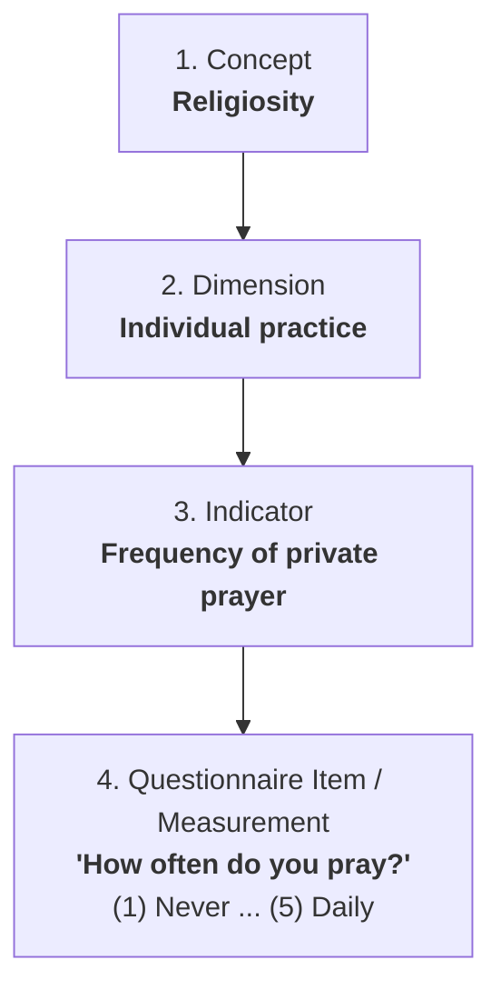
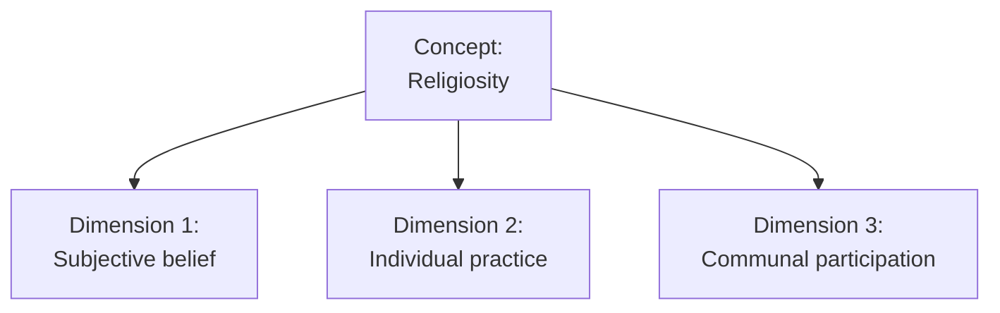

# Module items  { data-search-exclude }
## Assignment  { data-search-exclude data-readaloud-exclude }
- [Creating indicators :lucide-download:](https://docs.google.com/document/d/1f9TGx7B1UtOI1vOk7pEapJN5PdzTxe5U/edit?usp=sharing&ouid=100179871492576617561&rtpof=true&sd=true){ .md-button .md-button--primary target="_blank" rel="noopener" }
    - See: [[How to submit an assignment]]

## Sample assignment  { data-search-exclude data-readaloud-exclude }
- [Sample Creating indicators :lucide-download:](https://docs.google.com/document/d/1wEjEgHB0MxprCz9b3tfgzAqxJeheDdCH/edit?usp=sharing&ouid=100179871492576617561&rtpof=true&sd=true){ .md-button .md-button--primary target="_blank" rel="noopener" }

## Reading  { data-search-exclude data-readaloud-exclude }
<div class="grid cards" markdown>
:lucide-book-open:  
[De Vaus, D. A. 2014. “Concepts and Indicators.” Pp. 41–54 in Surveys in social research, Social research today. Abingdon, Oxon: Routledge.](https://drive.google.com/open?id=1ggDibpICdeFnltrH056aHAIKze7wT4-j&usp=drive_fs){target="_blank" rel="noopener"}
</div>

<!-- slide-break -->
## Learning outcomes { data-search-exclude }
1. Learn the difference between concepts and indicators
2. Understand the operational definition of a concept
3. Learn how to develop indicators
4. Identify the principles of indicators, (1) reliability and (2) validity

<!-- slide-break -->
# [[Concept]]
- A **concept** is a mental image summarizing collections of observations.
- Examples of concepts in social sciences:
    - *Religiosity*, *assimilation*, *social capital*, *alienation*, *job satisfaction*, *socio-economic status*.
- Concepts are abstract ideas:
    - They exist in our minds to help us organize and make sense of the world.
    - We cannot directly see, touch, or measure a concept (e.g., we cannot directly see "religiosity" or "assimilation").
    - Concepts do not have a single, fixed meaning. Different researchers and disciplines may define them differently.

<!-- slide-break -->
# [[Dimension]]
- A **dimension** is a specifiable aspect or facet of a concept.
- Most social science concepts are complex and have more than one side:
    - If we want to study the concept of **religiosity**, it has several distinct dimensions:
        1. **Subjective belief:** what a person believes internally (e.g., importance of God or faith).
        2. **Individual practice:** what a person does in private (e.g., personal prayer, reading sacred texts).
        3. **Communal participation:** what a person does with others in public (e.g., attending religious services).

<!-- slide-break -->
# [[Indicator]]
- An **indicator** is an observation that we choose to consider as a reflection of a dimension.
- It specifies *what observable behavior, attitude, or fact* we look for to measure a dimension:
    - For **Subjective belief** ➜ *Self-perceived devotion or importance of faith*
    - For **Individual practice** ➜ *Frequency of private prayer*
    - For **Communal participation** ➜ *Frequency of attending religious services*

<!-- slide-break -->
# [[Measurement]]
- A **questionnaire item / measurement** is the physical operation in the field (the question asked + response choices).
- This is the actual question written on the survey form and the answer options given to the respondent.



<!-- slide-break -->
## From concept to survey question

| Level | What it means | Example for Religiosity |
| :--- | :--- | :--- |
| **[[Concept]]** | A mental image summarizing collections of observations | **Religiosity** |
| **[[Dimension]]** | A specifiable aspect or facet of a concept | **Individual practice** (private religious life) |
| **[[Indicator]]** | An observation that we choose to consider as a reflection of a variable | **Frequency of private prayer** |
| **[[Measurement]]** | The physical operation in the field (the question asked + response choices) | **"How often do you pray privately?"**<br>(1) Never<br>(2) A couple of times a year<br>(3) Once a month<br>(4) Several times a week<br>(5) Daily |

<!-- slide-break -->
## Why measure?
- **To make fine distinctions:** Differentiate between people with subtle differences in attitudes or behaviors.
- **To have a consistent tool:** Provide a standardized way to measure distinctions so results are comparable across different people and surveys.
- **To produce precise estimates:** Allow us to use statistics (frequencies, correlations, regressions) to test our research questions.

<!-- slide-break -->
## Single vs. multiple indicators

| Feature | Single Indicator | Multiple Indicators |
| :--- | :--- | :--- |
| **Best for** | Simple, clear-cut facts (e.g., age, marital status, binary voting choice) | Complex, abstract concepts (e.g., religiosity, social capital, depression) |
| **Risk of misclassification** | **High:** One misunderstood question can misclassify a person | **Low:** Multiple questions average out individual errors |
| **Detail** | Rough, broad categories | Finer, more detailed scores |
| **Dimensions covered** | Only one small aspect | Captures multiple dimensions of a concept |

<!-- slide-break -->
## Why use more than one indicator?
1. **Single indicators can misclassify people:** A respondent might misunderstand a single question or interpret it differently than intended.
2. **Single indicators capture only part of the concept:** One question about church attendance misses private prayer and internal beliefs.
3. **Multiple indicators make finer distinctions:** Combining several questions into a scale gives a wider range of scores (e.g., a scale from 1 to 5) instead of a simple yes/no.

<!-- slide-break -->
# [[How to clarify concepts]]? (The 4-step process): From concept to survey question
1. **[[Obtain a range of definitions]] from the literature**: Explore how previous researchers have defined the concept.
2. **Decide on a [[nominal definition]]**: Choose or write a clear working definition for your research.
3. **[[Delineate the dimensions]]**: Break down the concept into its core dimensions.
4. **[[Develop indicators and survey questions]]**: Choose observable indicators and write clear questions and response choices for each dimension.

<!-- slide-break -->
## Step 1: [[Obtain a range of definitions]]

- | Source | Definition | Core focus |
  | :--- | :--- | :--- |
  | **Iddagoda and Opatha (2017)** | *"The extent to which a person believes in and venerates deities, practices teachings, and participates in activities."* | Belief + Practice + Participation |
  | **Mokhlis (2008)** | *"The degree to which beliefs in specific religious values and ideals are held and practiced by an individual."* | Internal values + Individual practice |
  | **Madni, Hamid, and Rashid (2016)** | *"How far the knowledge is, how strong the belief is, how much is the practice of worship, and how deep the appreciation of religion is."* | Knowledge + Belief + Worship + Appreciation |

<!-- slide-break -->
## Step 2: Decide on a [[nominal definition]]
- **Nominal definition**: A working definition assigned to a concept for the purpose of the study.
- **Example for Religiosity**: *"Religiosity is defined as the extent to which an individual holds religious beliefs, engages in private devotional practices, and participates in communal religious activities."*
    - This definition gives us clear guidance on what to measure: beliefs, private practices, and communal activities.

<!-- slide-break -->
## Step 3: [[Delineate the dimensions]]


<!-- slide-break -->
## Step 4: [[Develop indicators and questionnaire items]]

- | Dimension | Indicator | Survey Question Asked | Response Choices |
  | :--- | :--- | :--- | :--- |
  | **Subjective belief** | Self-perceived devotion | *"How religious are you?"* | (1) Not a believer at all<br>(2) Not really a believer<br>(3) A believer<br>(4) Devout<br>(5) Very devout |
  | **Individual practice** | Frequency of private prayer | *"How often do you pray privately?"* | (1) Never<br>(2) A couple of times a year<br>(3) Once a month<br>(4) Several times a week<br>(5) Daily |
  | **Communal participation** | Frequency of attending services | *"How often do you attend religious services or events?"* | (1) Never<br>(2) A couple of times a year<br>(3) Once a month<br>(4) Several times a week<br>(5) Daily |

    - ```mermaid
    graph TD
        Religiosity["Concept: <br> Religiosity"]
    
        Dim1["Dimension 1: <br> Subjective belief"]
        Dim2["Dimension 2: <br> Individual practice"]
        Dim3["Dimension 3: <br> Communal participation"]

        Ind1["Indicator 1: <br> Self-perceived devotion"]
        Ind2["Indicator 2: <br> Frequency of private prayer"]
        Ind3["Indicator 3: <br> Frequency of attending services"]
    
        Religiosity --> Dim1
        Religiosity --> Dim2
        Religiosity --> Dim3

        Dim1 --> Ind1
        Dim2 --> Ind2
        Dim3 --> Ind3
    ```

<!-- slide-break -->
# Evaluating indicators: [[reliability]] and [[validity]]
- Once questions are developed, we evaluate their quality using two main criteria:
    1. **[[Reliability]] (Consistency):** Does the question give the same result on repeated occasions?
    2. **[[Validity]] (Accuracy):** Does the question measure what it is actually supposed to measure?
    - ```mermaid
    flowchart LR
        subgraph Reliability["Reliability (Consistency)"]
            R1["Getting the same result every time"]
        end
        subgraph Validity["Validity (Accuracy)"]
            V1["Measuring the true concept intended"]
        end
        Reliability -->|Necessary, but not enough on its own for| Validity
    ```

<!-- slide-break -->
## [[Reliability]] of indicators
- A reliable measure is one where we obtain the same result on repeated occasions.
- **Common sources of unreliability**:
    - **Bad question wording:** Confusing or ambiguous words make respondents interpret questions differently each time.
    - **Interviewer effects:** The gender, dress, or tone of the interviewer can change how people answer.
    - **Guessing / No opinion:** When people have no information about a topic, they give random or inconsistent answers.
    - **Coder errors:** Mistakes when entering or coding survey data.

<!-- slide-break -->
### Ways to check [[Reliability]]
- **[[Test-retest]]**:
    - Ask the same sample the same questions at two different times (e.g., 2–4 weeks apart) and check if answers correlate.
        - People might remember their earlier answers, or their real attitude might have changed.
- **[[Internal consistency]] (Cronbach's alpha)**:
    - Checks whether multiple questions measuring the same concept produce consistent answers across respondents.
        - Values of alpha < 0.70 are considered acceptable.
 - **[[Inter-rater reliability]]** Two different researchers code or score the same responses to see if they agree.
    - Common for open-ended or observational data.

<!-- slide-break -->
## [[Validity]] of indicators
- A valid measure is one that measures what it is intended to measure.
- **Can a measure be reliable but not valid?**
    - **Yes:** A bathroom scale that is stuck and always adds 5 pounds is reliable (consistent every morning), but not valid (incorrect weight).
    - Therefore, **reliability does not guarantee validity**.

<!-- slide-break -->
### Types of [[Validity]]
- **[[Face validity]]**:
    - Does the question make sense on the surface?
        - Asking *"How often do you pray?"* makes intuitive sense as an indicator of individual religiosity.
- **[[Content validity]]**:
    - Do the questions cover all dimensions of the concept?
        - A religiosity survey that only asks about attending church lacks content validity because it ignores private beliefs and personal prayer.
- **[[Criterion validity]]**:
    - Does the measure agree with an established standard or predict behavior?
        - Higher scores on communal religiosity should predict higher participation in charity or volunteer work.
- **[[Construct validity]]**:
    - Does the measure relate to other concepts the way theory predicts?
        - Religiosity scores should correlate with moral values, but remain distinct from political party affiliation.
