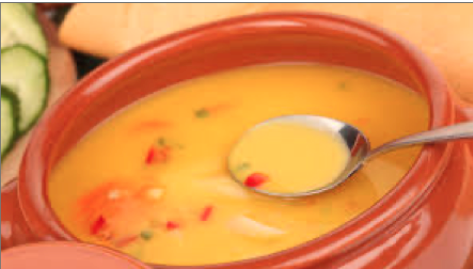
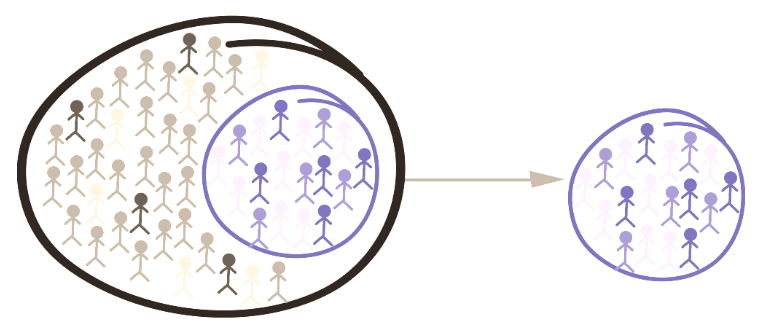
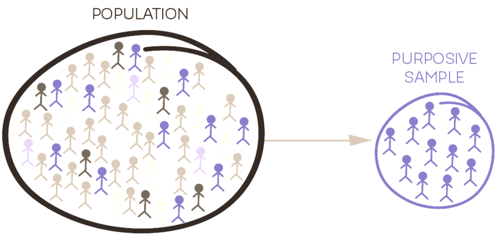
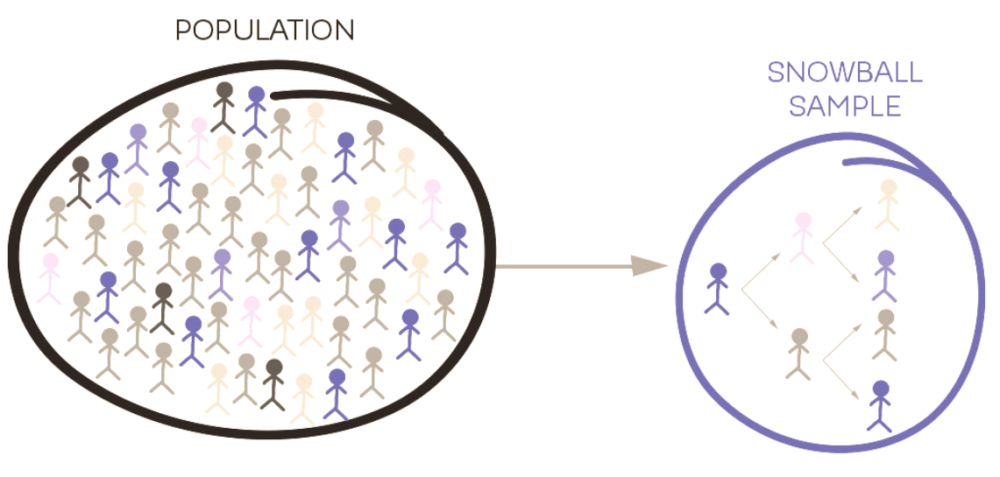
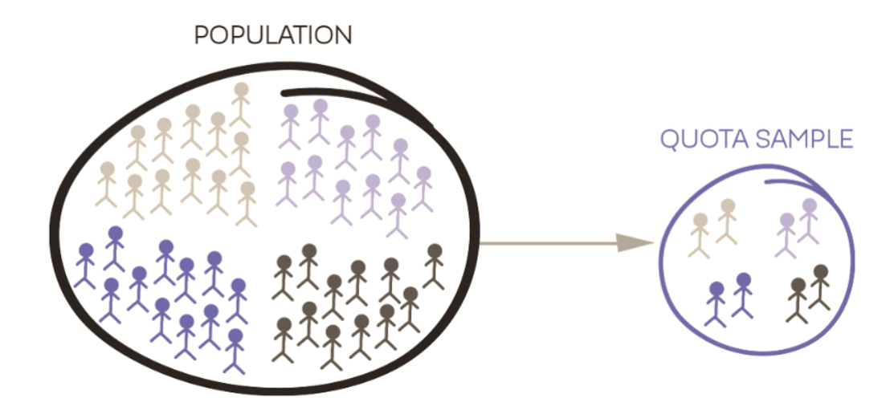

# Module items  { data-search-exclude }
## Assignment  { data-search-exclude data-readaloud-exclude }
- [Nonprobability sampling for coffee shop owners:lucide-download:](https://docs.google.com/document/d/1rg92uFWDLrN3dtX7749p6kxKCNwI3b-q/edit?usp=sharing&ouid=100179871492576617561&rtpof=true&sd=true){ .md-button .md-button--primary target="_blank" rel="noopener" }
    - See: [[How to submit an assignment]]

## Sample assignment  { data-search-exclude data-readaloud-exclude }
- [Sample Nonprobability sampling for coffee shop owners:lucide-download:](https://docs.google.com/document/d/1PaTbooaXIEXWQnE0WcHwDUsNYP8pGub-/edit?usp=sharing&ouid=100179871492576617561&rtpof=true&sd=true){ .md-button .md-button--primary target="_blank" rel="noopener" }

## Reading  { data-search-exclude data-readaloud-exclude }

:lucide-book-open:  
[Babbie, Earl R. 2013. “The logic of sampling” Pp. 183–90 in The practice of social research. Independence, KY: Wadsworth, Cengage Learning.](https://drive.google.com/open?id=1aGH4f2tALbs02luktW6y7qb2ZG1rw_QI&usp=drive_fs){target="_blank" rel="noopener"}

<!-- slide-break -->
## Learning outcomes { data-search-exclude }
1. Learn the basic terms and concepts related to sampling
2. Identify the differences between probability and non-probability sampling
3. Compare and contrast
    1. Convenience sample,
    2. Purposive sample,
    3. Snowball sample, and,
    4. Quota sample

<!-- slide-break -->
# [[Sampling concepts]]
- !!! abstract "Is the soup salty?"
    - You’ve made soup, and you want to know if it’s salty. What would you do?
        - 
            - ??? tip "Show the answer"
                - Stir the soup ➜ This ensures everything is mixed evenly.
                - Take a spoonful ➜ This small portion represents the whole pot.
                - Taste the spoonful ➜ You draw a conclusion about the entire soup.
                - So then,
                    - The soup ➜ the population (everyone or everything you want to study).
                    - Stirring ➜ ensuring representativeness (making sure the population is not biased or unevenly distributed).
                    - The spoonful ➜ the sample (a smaller subset of the population).
                    - Tasting ➜ analyzing data (using the sample to make conclusions).
<!-- slide-break -->
- **[[Population]]**: The universe of units from which the sample is to be selected.
    - Often people, but also newspapers, posts, classrooms, or organizations
- **[[Sample]]**: The segment of population that is selected for investigation.
- **[[Sampling]]**: The process of selecting units from a population so that we can generalize our results over the sample.
- **[[Randomness]]**: Everyone in the population has an equal chance of being selected
    - {width="400"}
- We almost always sample.
    - Time and cost make it impossible to study every relevant case.
- A representative sample is designed to act as a small version of the wider population.
- Other samples are chosen because they are information-rich for the question, not because they statistically represent everyone.

<!-- slide-break -->
# [[Sample size]]: How large should a sample be?
- There is no single correct number.
- Sample size depends on:
    - how mixed people are on the thing you care about,
    - what kind of analysis you plan to do,
    - how precise you need the estimate to be,
    - time, access, and cost.
- A larger sample reduces some kinds of error, but a large unrepresentative sample is still a poor sample.
- Qualitative studies often use fewer cases on purpose.
    - The goal is depth, and stopping when new interviews stop adding new themes.

<!-- slide-break -->
# [[Sampling methods]] 
- There are two main sampling methods:
    - Main distinction between these sampling types is the random selection of participants.
        - In **[[probability sampling]]** a sampling frame is used and participants are selected randomly.
        - In **[[non-probability sampling]]**, a sampling frame is not often available, and participants are not selected randomly.
- The choice of a sampling method depends on the type of study being conducted.

<!-- slide-break -->
## Types of [[non-probability sampling]]
1. [[Convenience sampling]]
2. [[Purposive sampling]]
3. [[Snowball sampling]]
4. [[Quota sampling]]

<!-- slide-break -->
### [[Convenience sampling]]
- !!! quote "Discussion"
    - Imagine you are preparing to conduct research involving a sample size of random 250 students from CSUMB.
    - Before proceeding, it's essential to verify the effectiveness of your questions in a real-world setting by conducting a pilot study.
    - To facilitate this pilot study, you must quickly find 10 students to participate.
    - How would you go about achieving this?
        - ??? tip "Show a sample answer"
            - *Since this is just a quick pilot study to test if my questions make sense and flow well, I would find 10 students as quickly and easily as possible.*
            - *I would immediately ask my roommates, friends, or the people sitting right next to me in my current class to spend 5 minutes taking the survey.*
            - *I would also walk over to the campus library or the coffee shop on campus and approach students sitting at tables, politely asking: 'Hey, I'm testing out a quick survey for a research class to make sure the questions are clear. Would you mind answering a few questions for 5 minutes?'*
                - *Because I'm not interested any kind of representativeness, these methods would let me get fast feedback, fix confusing wording, and refine my questions before rolling out the full study to the 250 students.*
<!-- slide-break -->
- In convenience sampling, the most easily accessible individuals are targeted.
    - In this type of sampling, researcher selects any participant who is readily available to participate in the study (e.g., people in your network, people in your classroom).
- Their participation happens based on availability.
- Useful when piloting a research. This type of sampling can be cost and time effective in the case of pilot studies.
- {width="500"}

<!-- slide-break -->
### [[Purposive sampling]]
- !!! quote "Discussion"
    - Following the pilot study, your advisor recommended concentrating on freshman students and targeting a sample size of 50, instead of the broader group of 250 students initially considered. This advice stems from the outcomes of the pilot study.
    - How would you go about achieving this?
        - ??? tip "Show a sample answer"
            - *Since I only need freshmen now, I would deliberately go to places where first-year students spend time.*
                - *I would email professors who teach First-Year Seminar (FYS) or big 100-level GE classes and ask if I can share my survey link with their students.*
                - *I would go outside the freshman residence halls or dining hall with a QR code and ask people passing by if they are a freshman and have 2 minutes to help.*
                - *Right at the start of the survey, I would ask: 'Are you a freshman?' If they say no, the survey just ends so I only collect responses from the right group.*
                - *I would ask orientation leaders or resident advisors (RAs) in freshman dorms to drop the link into their floor group chats.*

- Also known as judgmental sampling.
- A technique by which the researcher targets the sampling to a very specific population with unique characteristics (e.g., freshman students, high school dropouts, children who were homeschooled).
- Homogenous sampling is a type of purposive sampling where participants are chosen based on a trait or characteristic.
- {width="500"}
<!-- slide-break -->

### [[Snowball sampling]]
- !!! quote "Discussion"
    - You’re facing difficulties in finding freshman students, having found only two so far.
    - However, after conducting interviews with these two freshmen, you’ve come to understand that they are quite popular among their peers—one leads a student club, while the other has many freshman friends.
    - Given this realization that they have extensive connections with other freshmen, what strategies might you consider employing?
        - ??? tip "Show a sample answer"
            - *"Since I already have two well-connected freshmen, I would use snowball sampling by using their social networks to find more people.*
                - *At the end of each interview, I would ask them: 'Do you have 2 or 3 freshman friends who would be down to do this too? Could you introduce me or give them my contact info?'*
                - *With every new freshman I interview, I would repeat the same question: 'Can you connect me with 2 more freshman friends?'*
                    - *By having participants recruit other participants, the sample will snowball until I hit the number of students I need.*

- Researcher makes initial contact with a small group.
    - These respondents introduce others in their network.
        - In this type of sampling participants are selected by word-of-mouth.
- Sample may not be representative of the population as participants know each other in some way and may share characteristics such as social class, income, or religion.
    - Benefits to this strategy include its usefulness in identifying hard to reach populations (e.g., drug users).
- {width="500"}
<!-- slide-break -->
### [[Quota sampling]]
- !!! quote "Discussion"
    - The two freshmen who have many friends assisted you in identifying 50 freshmen. Meanwhile, you have further explored the literature and discovered that your topic is particularly well-suited for comparing Hispanic and non-Hispanic students.
    - Currently, your sample consists of 40 Hispanic and 10 non-Hispanic students, which does not offer a balanced comparative perspective.
    - What strategies might you consider employing for such comparison?
        - ??? tip "Show a sample answer"
            - *Since I want to compare the two groups fairly, I need equal numbers of both. Right now, I have 38 Hispanic students and only 12 non-Hispanic students.*
            - *I already have 38 Hispanic students, that group is basically full, so I would pause collecting data for that group.*
                - *I would spend all my remaining time actively looking for non-Hispanic freshmen until I reach my target number.*
                - *When approaching people, I'd ask: 'Are you a freshman? And do you identify as non-Hispanic?' If yes, I'd ask them to take the survey until that group reaches the quota too*

- A technique that allows the comparison of different groups within a population of interest.
- Researchers recruit participants based on specific criteria until each target category reaches its required count, such as,
    - 50 young,
    - 50 middle-aged,
    - 50 elderly participants
- It is a popular method for market researchers.
    - Participants are generally recruited on the streets.
        - Researchers stand at a street corner and conducts interviews until obtaining a quota.
- {width="500"}
