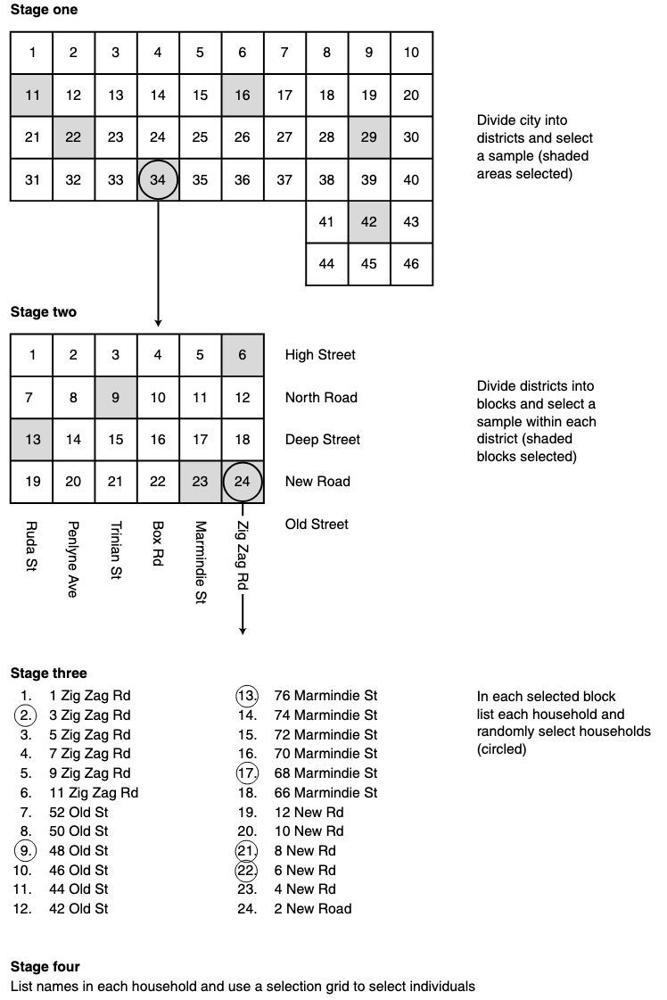

# Module items  { data-search-exclude }
## Assignment  { data-search-exclude data-readaloud-exclude }
- [Representative research design  :lucide-download:](https://docs.google.com/document/d/1Y9jad-qKYEj5UfkFIK6G_j_7CxToU2CH/edit?usp=sharing&ouid=100179871492576617561&rtpof=true&sd=true){ .md-button .md-button--primary target="_blank" rel="noopener" }
    - See: [[How to submit an assignment]]

## Sample assignment  { data-search-exclude data-readaloud-exclude }
- [Sample Representative research design  :lucide-download:](https://docs.google.com/document/d/1Y7pZtFJBCoT6dCA2x2Q__VXve1mF4Ima/edit?usp=sharing&ouid=100179871492576617561&rtpof=true&sd=true){ .md-button .md-button--primary target="_blank" rel="noopener" }
    - [Sample Sample size and budget  :lucide-download:](https://docs.google.com/spreadsheets/d/1Y8drJM1KHFE_gFcvsHa2qm0sgCRqZd00/edit?usp=sharing&ouid=100179871492576617561&rtpof=true&sd=true){ .md-button .md-button--primary target="_blank" rel="noopener" }

## Reading  { data-search-exclude data-readaloud-exclude }

:lucide-book-open:  
[Lohr, Sharon L. 2009. “Coverage and Sampling.” Pp. 97–112 in International handbook of survey methodology, edited by E. D. de Leeuw, J. J. Hox, D. A. Dillman, and Edith Desirée de Leeuw. New York, NY: Psychology Press.](https://drive.google.com/open?id=1Lx_YB7p8_9n57T_tqmvOj_FON6Yl5Bwx&usp=drive_fs){target="_blank" rel="noopener"}

<!-- slide-break -->
## Learning outcomes { data-search-exclude }
1. Compare and contrast probability sampling methods
    1. Simple random sampling,
    2. Systematic random sampling,
    3. Stratified random sampling, and
    4. Multi-stage cluster sampling
2. Learn the factors affecting sample size and quality

<!-- slide-break -->
# Four types of [[probability sampling]]
1. [[Simple random sampling]]
2. [[Systematic random sampling]]
3. [[Stratified random sampling]]
4. [[Multi-stage cluster random sampling]]

<!-- slide-break -->
## [[Simple random sampling]]
- In simple random sampling, each individual has an equal probability of selection, without considering any other criteria. There is full [[randomness]]. If the sample frame is know, we can:
    - List all individual and number them consecutively, and
    - Use random numbers to select individuals.
- There are **five steps** in selecting a simple random sample:
    1. Obtain a complete list of individuals.
    2. Give each individual a unique number starting at one 
    3. Decide on the required sample size.
    4. Select numbers for the sample size from a table of random numbers.
    5. Select the individuals that correspond to the randomly chosen numbers.
<!-- slide-break -->
- | Number | Name | Number | Name | Number | Name |
  |:---:|:---:|:---:|:---:|:---:|:---:|
  | 1 | Adams, H. | 18 | Iulianotti, G. | 35 | Quinn, J. |
  | 2 | Anderson, J. | 19 | Ivono, V. | 36 | Reddan, R. |
  | 3 | Baker, E. | **20** | **Jabornik, T.** | **37** | **Risteski, B**. |
  | 4 | Bradsley, W. | **21** | **Jacobs, B.** | **38** | **Sawers, R.** |
  | 5 | Bradley, P. | 22 | Kennedy, G. | 39 | Saunders, M. |
  | 6 | Carra, A. | 23 | Kassem, S. | 40 | Tarrant, A. |
  | 7 | Cidoni, G. | 24 | Ladd, F. | 41 | Thomas, G. |
  | 8 | Daperis, D. | **25** | **Lamb, A.** | 42 | Uttay, E. |
  | 9 | Devlin, B. | 26 | Mand, R. | 43 | Usher, V. |
  | 10 | Eastside, R. | **27** | **McIlraith, W.** | 44 | Varley, E. |
  | 11 | Einhorn, B. | 28 | Natoli, P. | 45 | Van Rooy, P. |
  | 12 | Falconer, T. | 29 | Newman, L. | **46** | **Walters, J.** |
  | 13 | Felton, B. | 30 | Ooj, W. | 47 | West, W. |
  | 14 | Garratt, S. | 31 | Oppenheim, F. | 48 | Yates, R. |
  | 15 | Gelder, H. | **32** | **Peters, P.** | 49 | Wyatt, R. |
  | 16 | Hamilton, I. | 33 | Palmer, T. | **50** | **Zappulla, T.** |
  | 17 | Hartnell, W. | **34** | **Quick, B.** |  |  |

<!-- slide-break -->
## [[Systematic random sampling]]
- Systematic random sampling is same as simple random sampling, except:
    - Choosing individuals from a random starting point, and choosing every nth individual (e.g., every 3rd individual).
        - {width="600"}
- There are **five steps** in selecting a systematic random sample:
    1. Determine population size (e.g. 100).
    2. Determine sample size required (e.g. 20). 
    3. Calculate sampling fraction (population / sample) (100/20=5)
    4. Select random staring point within first 5 cases (e.g. 3).
    5. Select every 5th case.
<!-- slide-break -->
- | Number  |Number   |Number   |Number   |Number   |
  |:---:|:---:|:---:|:---:|:---:|
  | 01 | 21 | 41 | 61 | 81 |
  | 02 | 22 | 42 | 62 | 82 |
  | **03** | **23** | **43** | **63** | **83** |
  | 04 | 24 | 44 | 64 | 84 |
  | 05 | 25 | 45 | 65 | 85 |
  | 06 | 26 | 46 | 66 | 86 |
  | 07 | 27 | 47 | 67 | 87 |
  | **08** | **28** | **48** | **68** | **88** |
  | 09 | 29 | 49 | 69 | 89 |
  | 10 | 30 | 50 | 70 | 90 |
  | 11 | 31 | 51 | 71 | 91 |
  | 12 | 32 | 52 | 72 | 92 |
  | **13** | **33** | **53** | **73** | **93** |
  | 14 | 34 | 54 | 74 | 94 |
  | 15 | 35 | 55 | 75 | 95 |
  | 16 | 36 | 56 | 76 | 96 |
  | 17 | 37 | 57 | 77 | 97 |
  | **18** | **38** | **58** | **78** | **98** |
  | 19 | 39 | 59 | 79 | 99 |
  | 20 | 40 | 60 | 80 | 100 |

<!-- slide-break -->
## [[Stratified random sampling]]
- Stratified random sampling is a probability sampling method in which a population is divided into subgroups (strata) based on a relevant characteristic, and a random sample is then selected separately from each stratum.
- The number selected from each stratum can be proportional to the stratum's size in the population, so that the sample reflects the population's composition.
- There are **three steps** in selecting a stratified random sample:
    1. Start by dividing the population into relevant subgroups, called strata.
        1. Strata might be colleges, departments, geographic regions, age groups, or other characteristics that are important to the research.
    2. Determine how many people to select from each stratum.
        1. If the goal is to make the sample proportionately representative of the population, each stratum contributes to the sample in proportion to its size in the population.
    3. Randomly select individuals within each stratum, using simple random sampling or systematic random sampling.
- **Example:**
    - Imagine a college with 10,000 students. We know which college or academic division each student belongs to, and this information is important because we want every college to be represented in our sample.
    - A simple random sample of 1,000 students could, by chance, include too many students from some colleges and too few from others. Instead, we use stratified random sampling:
        - We know their college affiliation, and this information is important for our research, as we want all colleges to be represented. Simple or systematic random sampling are not the best fit for such research.
            - We will instead choose sample proportionately represent the colleges.
    - With a simple random sample, we would randomly select 1,000 students from the entire population. By chance, some colleges could be overrepresented and others underrepresented. The table below shows a hypothetical example of what such a sample might look like.
    - With stratified random sampling, we first divide students into strata based on college affiliation and then randomly select students within each stratum. This allows us to ensure that each college is represented proportionately.
        - | Students         | Population |        % | Hypothetical simple random sample | Stratified random sample |
          | ---------------- | ---------: | -------: | --------------------------------: | ------------------------------: |
          | Humanities       |      1,800 |      18% |                               150 |                             180 |
          | Social sciences  |      1,200 |      12% |                               146 |                             120 |
          | Pure sciences    |      2,600 |      26% |                               289 |                             260 |
          | Applied sciences |      1,800 |      18% |                               164 |                             180 |
          | Engineering      |      2,600 |      26% |                               251 |                             260 |
          | **TOTAL**        | **10,000** | **100%** |                         **1,000** |                       **1,000** |
            - The key difference is that the simple random sample column is hypothetical and reflects what could happen by chance, whereas the stratified sample is deliberately allocated to match the population proportions.
<!-- slide-break -->
## Multi-stage cluster sampling
- Multi-stage cluster sampling is a probability sampling method in which the population is divided into clusters, and units are randomly selected through two or more stages, moving from larger clusters to smaller units until the final individuals are selected.
- Unlike stratified sampling, where we sample from every stratum, multi-stage cluster sampling selects some clusters and then samples within those selected clusters.
    - This is the most complex, expensive, and representative sampling.
- **Example:**
    - Imagine we want to survey residents of a large city, but we do not have a complete list of all residents. It would be expensive and impractical to randomly select individuals from the entire city.
    - Instead, we could use multi-stage cluster sampling (in seven steps):
        1. Divide the city into districts (clusters).
        2. Randomly select some districts.
        3. Divide the selected districts into smaller areas or blocks.
        4. Randomly select some blocks within each selected district.
        5. List the households in the selected blocks.
        6. Randomly select households.
        7. Within each selected household, randomly select an individual to participate.
    - The process therefore involves several successive random samples, rather than selecting individuals directly from the entire population.
        - | Stage | Population unit                        | What we randomly select |
          | ----- | -------------------------------------- | ----------------------- |
          | 1     | City districts                         | Districts               |
          | 2     | Blocks within selected districts       | Blocks                  |
          | 3     | Households within selected blocks      | Households              |
          | 4     | Individuals within selected households | Individuals             |
    - The image (from De Vaus, 2014) illustrates this progression: city → districts → blocks → households → individuals.
        - {width="600"}

<!-- slide-break -->
# [[Factors affecting sampling]]
- When designing a representative research study, several practical and statistical factors influence both the required sample size and the overall quality of the data:
    - [[Time and cost]]: Increasing the sample size provides diminishing returns in precision after a certain point (often around n=1,000).
        - Because of this, very large samples become decreasingly cost-efficient.
    - [[Heterogeneity of the population]]: The more varied or diverse the target population is, the larger the sample will need to be to accurately capture that variation.
    - [[Response rate]]: The response rate is the percentage of the selected sample who actually agree to participate or provide usable data.
        - This is critical because responders and non-responders may systematically differ on a crucial variable, which can introduce bias.
# Calculating [[sample size]]
- Determining the correct sample size requires balancing how much error you are prepared to tolerate against how certain you want to be about your generalizations. There are two important concepts:
    - **(1) [[Sampling error]]**: The difference between a statistic calculated from a sample (e.g., a sample mean or percentage) and the true value of that statistic in the population, caused simply by the fact that we surveyed a sample instead of everyone.
        - It exists because different random samples drawn from the same population will produce slightly different results just by chance, even with a perfectly designed, unbiased sampling method.
            - Sampling error is not a mistake. It's an unavoidable statistical property of sampling itself.
        - As sample size increases, sampling error decreases. However, each additional respondent reduces error less than the one before (this is why the sample size table shows diminishing returns as population size grows).
        - Sampling error is typically expressed as a margin of error (e.g., "± 3 percentage points"), which tells us the range within which the true population value likely falls.
    - **(2) [[Confidence interval]]**: A confidence interval is the range of values, built around a sample statistic, within which we expect the true population value to fall.
        - A confidence interval is always reported together with a confidence level (commonly 95% or 99%), which tells us how much certainty we have that the interval contains the true population value.
            - A 95% confidence level means: if we repeated the survey 100 times using the same method, about 95 of the 100 resulting confidence intervals would contain the true population value.
            - A higher confidence level (99% vs. 95%) and a narrower sampling error (e.g., ±1% vs. ±5%) requires a larger sample to maintain a level of certainty.
- **Sample size requirements by population size, confidence level, and sampling error**
    - Each row is a population size; each column is a confidence level + margin of error combo.
        - The cell tells you the minimum sample size needed to hit that precision for that population.
    - As population size grows, required sample size levels barely changes. That's why the bottom rows (250,000 up to 300,000,000) look almost identical.
    - The U.S. population (~340 million) falls in that flattened range, so a sample of 1,537 people gives a 95% confidence level at a ±2.5% margin of error
        - This is why national polls routinely use samples around 1,000–1,500 regardless of how large the country's population actually is.
    - | Population Size |     95% (±5.0%) |     95% (±3.5%) |     95% (±2.5%) |     95% (±1.0%) |     99% (±5.0%) |     99% (±3.5%) |     99% (±2.5%) |    99% (±1.0%) |
  | ---------------: | ---------------: | ---------------: | ---------------: | ---------------: | ---------------: | ---------------: | ---------------: | ---------------: |
  |                10 |               10 |               10 |               10 |               10 |               10 |               10 |               10 |               10 |
  |                20 |               19 |               20 |               20 |               20 |               19 |               20 |               20 |               20 |
  |                30 |               28 |               29 |               29 |               30 |               29 |               29 |               30 |               30 |
  |                50 |               44 |               47 |               48 |               50 |               47 |               48 |               49 |               50 |
  |                75 |               63 |               69 |               72 |               74 |               67 |               71 |               73 |               75 |
  |               100 |               80 |               89 |               94 |               99 |               87 |               93 |               96 |               99 |
  |               150 |              108 |              126 |              137 |              148 |              122 |              135 |              142 |              149 |
  |               200 |              132 |              160 |              177 |              196 |              154 |              174 |              186 |              198 |
  |               250 |              152 |              190 |              215 |              244 |              182 |              211 |              229 |              246 |
  |               300 |              169 |              217 |              251 |              291 |              207 |              246 |              270 |              295 |
  |               400 |              196 |              265 |              318 |              384 |              250 |              309 |              348 |              391 |
  |               500 |              217 |              306 |              377 |              475 |              285 |              365 |              421 |              485 |
  |               600 |              234 |              340 |              432 |              565 |              315 |              416 |              489 |              579 |
  |               700 |              248 |              370 |              481 |              653 |              341 |              462 |              554 |              672 |
  |               800 |              260 |              396 |              526 |              739 |              363 |              503 |              615 |              763 |
  |             1,000 |              278 |              440 |              606 |              906 |              399 |              575 |              726 |              943 |
  |             1,200 |              291 |              474 |              674 |            1,067 |              427 |              636 |              826 |            1,119 |
  |             1,500 |              306 |              515 |              759 |            1,297 |              460 |              712 |              958 |            1,376 |
  |             2,000 |              322 |              563 |              869 |            1,655 |              498 |              807 |            1,140 |            1,785 |
  |             2,500 |              333 |              597 |              952 |            1,984 |              524 |              878 |            1,287 |            2,172 |
  |             3,500 |              346 |              641 |            1,068 |            2,565 |              558 |              976 |            1,509 |            2,890 |
  |             5,000 |              357 |              678 |            1,176 |            3,288 |              586 |            1,065 |            1,733 |            3,842 |
  |             7,500 |              365 |              710 |            1,275 |            4,212 |              609 |            1,146 |            1,960 |            5,164 |
  |            10,000 |              370 |              727 |            1,332 |            4,899 |              622 |            1,192 |            2,096 |            6,238 |
  |            25,000 |              378 |              760 |            1,448 |            6,939 |              646 |            1,284 |            2,398 |            9,968 |
  |            50,000 |              381 |              772 |            1,491 |            8,057 |              654 |            1,318 |            2,519 |           12,449 |
  |            75,000 |              382 |              776 |            1,506 |            8,514 |              657 |            1,329 |            2,562 |           13,576 |
  |           100,000 |              383 |              778 |            1,513 |            8,763 |              659 |            1,335 |            2,584 |           14,220 |
  |           250,000 |              384 |              782 |            1,527 |            9,249 |              661 |            1,346 |            2,624 |           15,546 |
  |           500,000 |              384 |              783 |            1,532 |            9,423 |              662 |            1,350 |            2,638 |           16,045 |
  |         1,000,000 |              384 |              783 |            1,534 |            9,513 |              663 |            1,351 |            2,645 |           16,306 |
  |         2,500,000 |              384 |              784 |            1,536 |            9,567 |              663 |            1,352 |            2,649 |           16,467 |
  |        10,000,000 |              384 |              784 |            1,536 |            9,595 |              663 |            1,353 |            2,652 |           16,549 |
  |       100,000,000 |              384 |              784 |            1,537 |            9,603 |              663 |            1,353 |            2,652 |           16,574 |
  |       300,000,000 |              384 |              784 |            1,537 |            9,604 |              663 |            1,353 |            2,652 |           16,576 |