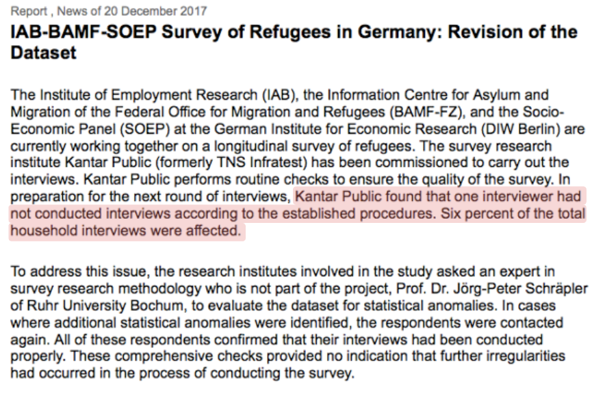
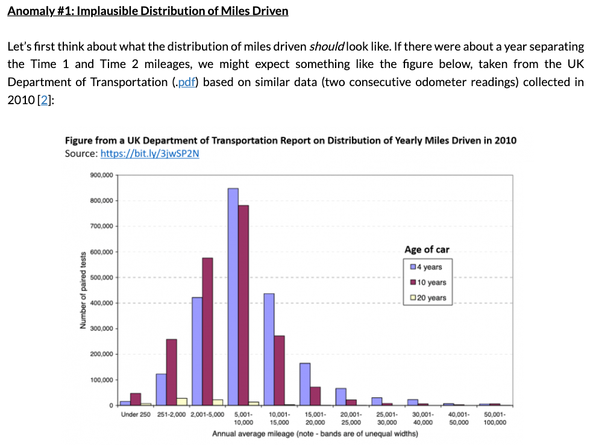
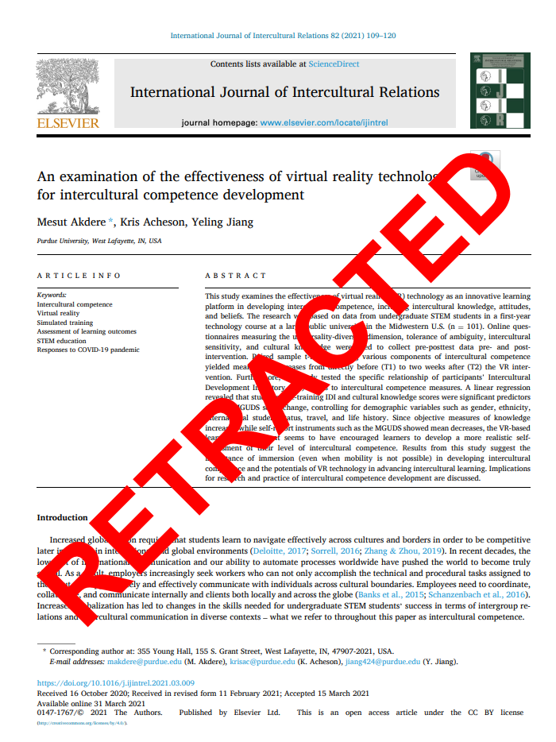
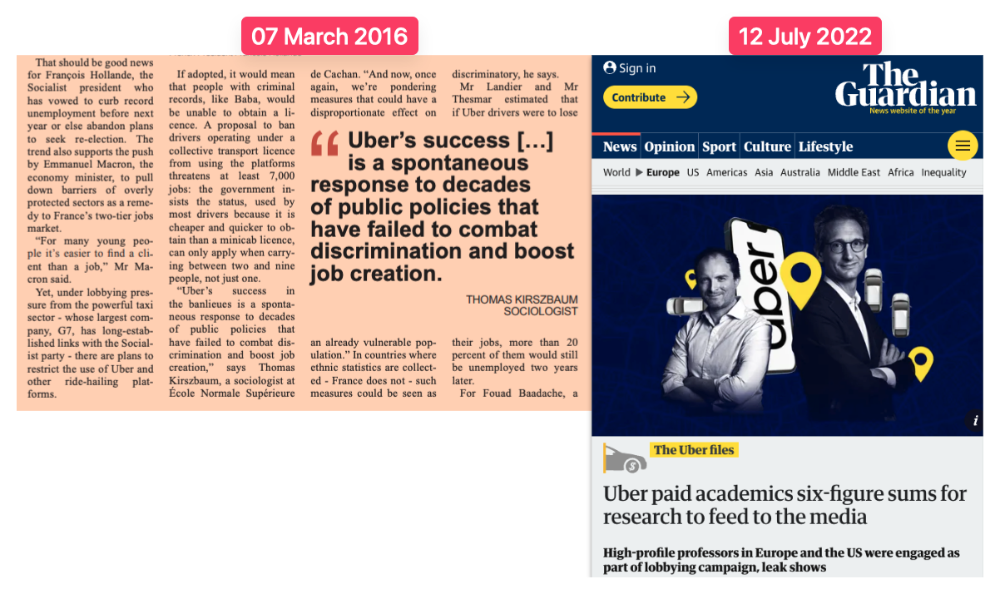

# Module items  { data-search-exclude }
## Assignment  { data-search-exclude data-readaloud-exclude }
- [IRB vs researchers :lucide-download:](https://docs.google.com/document/d/1YbFOW_dq45g7e0NLaYOjJqGNIsJkvfr_/edit?usp=sharing&ouid=100179871492576617561&rtpof=true&sd=true){ .md-button .md-button--primary target="_blank" rel="noopener" }
    - See: [[How to submit an assignment]]

## Sample assignment  { data-search-exclude data-readaloud-exclude }
- No sample

## Reading  { data-search-exclude data-readaloud-exclude }

:lucide-book-open:  
[National Research Council. 2010. “Basic Concepts.” Pp. 23–53 in Protecting participants and facilitating social and behavioral sciences research. Washington, D.C: National Academies Press.](https://drive.google.com/open?id=1GXJKrdLwtPPR-hyWVjLPrQbhwhaPegOF&usp=drive_fs){target="_blank" rel="noopener"}

<!-- slide-break -->
## Learning outcomes { data-search-exclude }
1. Define ethical research and identify different types of harm.
2. Explain the pillars of ethical research
    1. Voluntary participation
    2. Anonymity
    3. Confidentiality
    4. Privacy
    5. Data security
    6. Institutional Review Board (IRB)
3. Identify unethical research practices
    1. Faking surveys
    2. Faking data
    3. The role of funders

<!-- slide-break -->
# What is [[ethical research]]?
- Ethical research means treating research participants fairly and protecting them from unnecessary harm.
- Researchers should:
    - Reduce possible harm and risks as much as possible.
    - Make sure participation is voluntary.
    - Clearly explain what participants are agreeing to.
    - Respect participants' privacy.
    - Protect personal and sensitive information.
    - Be honest about the research and how the information will be used.
- !!! abstract "Incentives"
    - Researchers can offer incentives, including money or extra credit.
        - However, the incentive should not be so important that participants feel they cannot reasonably refuse.
            - When extra credit is offered, students should generally have another way to earn comparable credit without participating in the research.
<!-- slide-break -->
## How could we harm research participants?
- **Psychological harm:** causing stress, embarrassment, fear, or damage to self-esteem.
- **Social harm:** damaging someone's relationships or reputation.
- **Economic harm:** hurting someone's employment or career opportunities.
- **Legal harm:** revealing information that could create legal problems.
- **Privacy harm:** collecting personal information that is not necessary for the research.
- **Confidentiality harm:** allowing private information or a participant's identity to become known.
<!-- slide-break -->
# [[Ethical research]]
1. [[Voluntary participation]]
2. [[Anonymity]]
3. [[Confidentiality]]
4. [[Privacy]]
5. [[Data security]]
6. [[Institutional review board]] (IRB)

## [[Voluntary participation]]
- Any research requires revealing personal information to strangers.
- Therefore, participation must be voluntary:
    - The principle that individuals must choose to participate in research without being forced.
- Right to withdraw: Participants should be able to withdraw from the research at any stage without any penalty.
- [[Informed consent]]: Informed consent is provided using an informed consent form that is read aloud and signed by participants before a study begins.
    - In research, it is the right of every person to make informed decisions regarding whether to participate in a research study.
    - Obtaining informed consent for a research study requires open and honest communication between the researcher and the study participant.
    - **Researchers should clearly explain**:
        - What participants will be asked to do.
        - How long participation will take.
        - Any sensitive questions or activities.
        - Possible risks or discomfort.
        - How their information will be used.
- Participants should have enough information to make an informed decision about participating.
- Researchers should not hide important risks simply because doing so might reduce participation.
- !!! abstract "Children and minors"
    - Children cannot provide legal consent on their own.
    - Researchers generally need **parental consent** and the child's **assent**.
        - **Parental consent:** A parent or guardian agrees to the child's participation.
        - **Assent:** The child also agrees to participate in a way appropriate for their age.
    - School approval does not automatically replace parental consent.

<!-- slide-break -->
## [[Anonymity]]
- Anonymity means that no one, including the researcher, can connect a participant's identity to their answers.
- The best way to provide anonymity is to **not collect names or other identifying information in the first place**.
    - Example: An anonymous survey does not ask for your name, student ID, email address, or other information that could reveal who you are.
- If researchers can identify who gave a particular answer, the study is **not anonymous**, even if they promise not to reveal the person's identity.

## [[Confidentiality]]
- Confidentiality means the researcher may know who participated, but promises **not to reveal participants' identities or private information**.
- Unlike [[anonymity]], the researcher may have information that connects a participant to their responses.
    - Example: In an interview study, the researcher may know the participant's name but use a fake name when reporting the findings.
- Researchers can protect confidentiality by:
    - Replacing names with ID numbers or pseudonyms.
    - Keeping names separate from research data.
    - Limiting who can access the data.
    - Avoiding details in publications that could reveal who a participant is.
- Confidentiality is especially important when research involves sensitive topics that could harm participants if their identities became known.

## [[Privacy]]
- Privacy is about a participant's right to control **what personal information researchers can access or ask about**.
- Researchers should not collect personal information simply because it might be interesting.
    - They should collect only information that is actually needed for the research.
- Privacy also applies to **where and how data are collected**.
    - Example: Asking someone sensitive questions in a private interview room protects their privacy better than asking those questions where other people can hear.
- Researchers should also think about whether information is truly public before observing or using it for research.
- Protecting privacy means respecting the boundaries of participants' personal lives.

## [[Data security]]
- Data security is about how research data are stored and protected after they are collected. Researchers are responsible for protecting research data after they collect or receive them.
- Researchers should prevent unauthorized people from accessing participants' information.
- Researchers can protect data by:
    - Storing files in secure locations.
    - Using passwords or encryption.
    - Limiting access to the research team.
    - Keeping identifying information separate from research responses.
    - Deleting identifying information when it is no longer needed.
- Many secondary datasets, especially those containing sensitive information, require researchers to sign a **data use agreement** before getting access.
    - These agreements require researchers to explain exactly how the data will be stored, who will have access, and how the data will be protected.
        - !!! abstract "Example: PASS"
            - The [PASS dataset](https://fdz.iab.de/en/data-access/scientific-use-files/){: target="_blank" rel="noopener" } is distributed through the German Institute for Employment Research.
            - Even though the Scientific Use File is anonymized, researchers must submit a detailed **data security plan** before their request can be approved.
            - Researchers are required to:
                - Specify the **building and room** where the data will be used and who can enter that space,
                    - Including the information of those who have the keys to that building and room.
                - Store the data only on **approved and encrypted computers or servers**.
                - Make sure that only **authorized researchers** can access the data.
                - Not send the individual-level data by **email**.
                - Use password-protected computers, updated security software, and secure connections.
                - Prevent other people from seeing the screen and not take **screenshots, videos, or printouts** of the data.
                - **Securely delete** the data, including copies and backups, when the data use agreement ends.

## [[Institutional review board]] (IRB)
- [[Institutional review board|IRB]] is a review board with at least five members, one of whom comes from outside the institution.
- These members review for approval research protocols submitted by researchers prior to the conduct of any research.
- Every institution that receives federal funding must have an IRB.
    - See [CSUMB IRB website](https://csumb.edu/departments/office-of-research/research-compliance/human-subjects-research-irb/){: target="_blank" rel="noopener" }.
- They must determine whether the benefits of a study outweigh its risks, whether consent procedures have been carefully carried out, and whether any group of individuals has been unfairly treated or left out of the potential positive outcomes of a given study (Beyrer & Kass, 2002).
- IRB approval is only the starting point; researchers must continue protecting participants through anonymity, confidentiality, and privacy.

<!-- slide-break -->
# Some [[unethical practices]]
1. **[[Faking surveys]]**: Surveyors in the field.
2. **[[Faking data]]**: Principal investigators and selectively reporting results.
3. **[[Private funders]]** and principal investigators: The dangerous relationship between principal investigators and private funders.

<!-- slide-break -->
## [[Faking surveys]]: Surveyors in the field
- Even in the most professional surveys, there exists the potential for some surveyors to fabricate surveys or not follow appropriate procedures.
- This dishonesty distorts findings and undermines the validity and reliability of survey results.
    - 
        - In the SOEP survey (which is considered one of the most reputable research), one interviewer did not follow the required procedures, affecting about **6% of interviews**.
        - The research team investigated the problem, contacted participants again to verify interviews, and revised the dataset.
        - Some cases can be detected through careful checks like how SOEP team does, but not all fake or improper interviews will necessarily be discovered.
- !!! abstract "Example: Quality and fraud control in the ENTRA survey"
    - The [ENTRA (Recent Immigration Processes and Early Integration Trajectories in Germany) survey](https://search.gesis.org/research_data/ZA7773?doi=10.4232/1.14014){: target="_blank" rel="noopener" } team used several checks to prevent and detect **fake interviews** and participation by the **wrong person**.
    - For interviewer-administered surveys, interviewers received adequate compensation, regular feedback, and supervision to reduce incentives for fraud.
    - After the first wave, researchers compared respondents' **gender and date of birth** with official registration records.
        - Online respondents were also asked whether they had completed the survey for someone else.
    - About **8% of respondents (N = 368)** showed suspicious differences or admitted that someone else had completed the survey.
        - Suspicious cases appeared at similar rates across survey methods, suggesting that many cases may have involved interviewing the wrong person rather than deliberate interviewer fraud.
            - Nevertheless, **all suspicious cases were removed from the final sample**.

<!-- slide-break -->
## [[Faking data]] 
### Principal investigators
- Even among the most esteemed academic circles, there are instances where researchers manipulate or fabricate data.
- Such malpractices can lead to the retraction of published articles, damaging both the credibility of the research and the integrity of academic scholarship.
    - [A highly influential 2012 study](https://pmc.ncbi.nlm.nih.gov/articles/PMC3458378){: target="_blank" rel="noopener" } claimed that people were more honest when they signed an honesty statement before reporting information rather than after.
    - Years later, [other researchers](https://datacolada.org/98){: target="_blank" rel="noopener" } examined the publicly available data and found patterns that did not look like real human data.
        - Some values appeared to have been randomly generated, and parts of the dataset appeared to have been duplicated and slightly changed.
            - 
<!-- slide-break -->
### Selectively reporting results
- Researchers do not have to invent numbers to misrepresent a study. They can also leave out information that changes how we understand the results.
- A [2021 study](https://www.sciencedirect.com/science/article/pii/S0147176721000468){: target="_blank" rel="noopener" } examined whether virtual reality could improve intercultural competence.
    - The published article left out an additional group from the original study.
    - After an investigation, it was found that the lead researcher was responsible for omitting that group, and the journal retracted the article in 2023.
        - 
<!-- slide-break -->
## [[Private funders]]
- Research is often funded by governments, universities, foundations, and private companies.
- Private funding is not automatically unethical, but it can create a conflict of interest when a company benefits from particular research findings.
    - [Uber paid academics and think tanks](https://www.ft.com/content/bf3d0444-e129-11e5-9217-6ae3733a2cd1){: target="_blank" rel="noopener" } to produce research that supported favorable claims about the company, such as creating jobs, providing affordable transportation, and increasing productivity.
        - Some of this research was then used in the media and in Uber's lobbying efforts to influence public policy.
        - The problem is especially serious when readers are not clearly told who funded the research or what relationship the researcher has with the company.
            - One report by a French academic, who asked for a €100,000 consultancy fee, was cited in a 2016 Financial Times report as evidence that Uber was a “route out of the French banlieues”, delighting Uber executives.
                - 
<!-- slide-break -->

