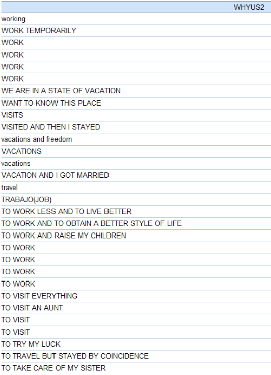

# Module items  { data-search-exclude }
## Assignment  { data-search-exclude data-readaloud-exclude }
- [Crafting questions :lucide-download:](https://docs.google.com/document/d/1YmvUtPBtZB2GO9uz6OrbmSgBk7MCHs1f/edit?usp=sharing&ouid=100179871492576617561&rtpof=true&sd=true){ .md-button .md-button--primary target="_blank" rel="noopener" }
    - See: [[How to submit an assignment]]

## Sample assignment  { data-search-exclude data-readaloud-exclude }
- [Sample Crafting questions :lucide-download:](https://docs.google.com/document/d/1gc-01i9w6ASxrA5BAn6vkOcqs32jewZL/edit?usp=sharing&ouid=100179871492576617561&rtpof=true&sd=true){ .md-button .md-button--primary target="_blank" rel="noopener" }

## Reading  { data-search-exclude data-readaloud-exclude }

:lucide-book-open:  
[Fink, Arlene. 2017. “The Survey Form: Questions, Scales, and Appearance.” Pp. 35–66 in How to conduct surveys: A step-by-step guide. Los Angeles: Sage.](https://drive.google.com/open?id=1vaOXzMw4dzGbw0_el9kW3Z59GW0rw-RC&usp=drive_fs){target="_blank" rel="noopener"}

<!-- slide-break -->
## Learning outcomes { data-search-exclude }
1. Explain why question wording affects survey answers
2. Write short and clear survey questions
3. Distinguish single-barreled and double-barreled questions
4. Distinguish neutral and leading questions
5. Match survey questions with useful response categories
6. Use a checklist to revise weak survey questions

<!-- slide-break -->
# Why [[survey questions]] matter
- It is the main measurement tool.
- A good survey question helps every respondent:
    1. Understand the same thing,
    2. Remember or judge the answer in the same way, and
    3. Choose from response categories that fit what they want to say.
- If the question is unclear, the data will be unclear.
- Poor question wording makes respondents guess, skip the question, or quit the survey.

<!-- slide-break -->
# Writing [[survey questions]]

## Rule 1: Write [[single-barreled questions]]
- A good survey question should be single-barreled:
    - It asks about one thing.
    - The respondent knows exactly what to answer.
    - The researcher knows what the answer means.
- [[Double-barreled questions]] ask about two or more things at once.
    - This creates a problem because the respondent may agree with one part and disagree with another.
        - !!! abstract "Single-barreled vs. double-barreled questions"
            - | Bad question | Problem | Good question |
              | :--- | :--- | :--- |
              | How satisfied are you with your classes and professors? | Classes and professors are not the same thing. | How satisfied are you with your classes?   How satisfied are you with your professors? |
              | Do you support increasing tuition and improving campus services? | A respondent may support services but oppose tuition increases. | Do you support increasing tuition?   Do you support increasing funding for campus services? |
              | How often do you visit your mother and father? | A respondent may visit one parent more often than the other. | How often do you visit your mother?   How often do you visit your father? |

<!-- slide-break -->
## Rule 2: Write [[short questions]]
- Short questions are easier to understand.
- [[Long questions]] create more room for confusion.
- A question can be too long when it:
    - Includes unnecessary background information,
    - Uses too many clauses,
    - Asks the respondent to remember too many details at once, or
    - Makes the respondent do a calculation in their head.
- The goal is **short and specific**.
    - !!! abstract "Short vs. long questions"
        - | Bad question  | Problem | Good question |
          | :--- | :--- | :--- |
          | Thinking about everything that has happened in your college experience, including your classes, professors, classmates, assignments, advising, and other campus experiences, how satisfied are you overall? | Too much to hold in mind at once. | Overall, how satisfied are you with your college experience? |
          | In the past 30 days, when you used public transportation, how often did you experience a delay of more than 15 minutes? | Respondent must remember trips, delays, and calculate a frequency. | In the past 30 days, how many times did you use public transportation?   How many of those trips were delayed by more than 15 minutes? |
          | Has it ever happened to you that over a long period of time you wanted to find a job but were not able to find one? | Awkward and indirect. | Have you ever been unemployed while looking for work? |
<!-- slide-break -->
## Rule 3: Write [[simple questions]]
- Use words respondents already know.
- Avoid [[complex questions]]:
    - Questions that include jargon, technical terms, and academic language.
- The question should sound like something any person can answer.
- If a technical term is necessary, define it before asking the question.
    - !!! abstract "Simple vs. complex questions"
        - | Bad question | Problem | Good question |
          | :--- | :--- | :--- |
          | Does your household follow patriarchal decision-making practices? | Uses academic language. | Who usually makes major financial decisions in your household? |
          | How often do you engage in political participation? | Too broad and abstract. | In the past 12 months, have you voted, attended a public meeting, contacted an elected official, or joined a protest? |
          | Do you experience food insecurity? | May not mean the same thing to everyone. | In the past 30 days, did you ever skip a meal because there was not enough money for food? |

<!-- slide-break -->
## Rule 4: Write [[specific questions]]
- Avoid [[vague questions]]:
    - Questions that can mean different things to different people.
- A specific question gives respondents a clear frame of reference:
    - Who?
    - What?
    - Where?
    - During what time period?
- Words like *often*, *regularly*, *family*, *crime*, *healthy*, and *community* can be interpreted in many ways.
    - !!! abstract "Simple vs. complex questions"
        - | Bad question | Problem | Good question |
          | :--- | :--- | :--- |
          | Do you exercise regularly? | "Regularly" is vague. | During the past 7 days, on how many days did you exercise for at least 30 minutes? |
          | Do you often talk to your neighbors? | "Often" is vague. | During the past month, how many times did you talk with a neighbor? |
          | Have you been a victim of crime? | Respondents may define crime differently. | In the past 12 months, has anyone stolen money or property from you? |

<!-- slide-break -->

## Rule 5: Write [[neutral questions]]
- Neutral questions do not push the respondent toward one answer.
- [[Leading questions]] suggest that one answer is better, more moral, more popular, or more correct.
- Leading questions weaken the survey because they measure reaction to the wording, not only the respondent's real opinion.
    - !!! abstract "Neutral vs. leading questions"
        - | Bad question | Problem | Good question |
          | :--- | :--- | :--- |
          | Do you agree that the university should finally fix the unfair parking system? | Pushes the respondent toward agreement. | Do you favor or oppose changing the university parking system? |
          | Should the city waste taxpayer money on a new stadium? | Uses loaded wording. | Do you favor or oppose using city funds for a new stadium? |
          | Do you support protecting innocent children by increasing school security? | Builds an argument into the question. | Do you favor or oppose increasing school security? |

<!-- slide-break -->
## Rule 6: Write [[positive questions]]
- Questions with *not* can be confusing.
- [[Double negative questions]] are especially confusing.
- If respondents have to stop and decode the sentence, the question is too complicated.
- A positive wording is usually clearer.
    - !!! abstract "Positive questions vs. double negative questions"
        - | Bad question | Problem | Good question |
          | :--- | :--- | :--- |
          | Do you agree that marijuana should not be illegal? | Contains a confusing negative. | Do you think marijuana should be legal? |
          | Should students not be allowed to skip advising? | Hard to know what "yes" means. | Should students be required to meet with an advisor? |
          | I do not feel unsafe on campus. Agree or disagree? | Agreement means a positive feeling, but the wording is negative. | How safe do you feel on campus? |
<!-- slide-break -->

## Rule 7: Write appropriate [[response category|response categories]]
- The response categories are part of the question.
- Good response categories should be:
    - **[[Exhaustive]]:** every respondent can find an answer that fits.
    - **[[Mutually exclusive]]:** no respondent fits two answers at once.
    - **[[Balanced]]:** positive and negative options are treated evenly.
    - **[[Ordered]]:** if the categories have a scale, the order should be clear.
- **Response category examples**
    - | Rule | Weak response categories | Problem | Better response categories |
      | :--- | :--- | :--- | :--- |
      | Exhaustive | What is your employment status?   Employed  Unemployed | Leaves out students, retired people, homemakers, and disabled respondents. | Employed  Unemployed and looking for work  Student  Retired  Not working for another reason |
      | Mutually exclusive | What is your main way of getting to campus?   Drive alone  Carpool  Use a car  Take public transportation | A respondent who drives alone or carpools also “uses a car,” so more than one answer can fit. | Drive alone  Carpool  Public transportation  Walk  Bike |
      | Balanced | How satisfied are you?   Very satisfied  Satisfied  Somewhat satisfied  Not satisfied | Mostly positive categories. | Very satisfied  Somewhat satisfied  Somewhat dissatisfied  Very dissatisfied |
      | Ordered | How often do you attend campus events?   Often  Never  Sometimes  Rarely | The scale is not in a logical order. | Never  Rarely  Sometimes  Often |

<!-- slide-break -->
## Rule 8: Avoid [[open-ended questions]]
- [[Open-ended questions]] let respondents answer in their own words.
- [[Closed-ended questions]] ask respondents to choose from a list.
- In surveys, closed-ended questions are better because they produce answers that can be compared across respondents.
- Open-ended questions are useful in the **pilot stage**:
    - To learn how respondents think about the topic,
    - To discover missing response categories, and
    - To improve the final closed-ended question.
- Open-ended questions should usually not be used in the main survey.
    - If 1,000 people answer in their own words, someone has to read, interpret, and qualitatively code those answers.
    - That turns the survey back into qualitative analysis.
    - If we want that kind of rich answer, a qualitative interview is usually the better method.
- "**Other**" may look like an easy fix, but it often signals that the response categories were not developed carefully enough.
    - If many respondents choose "Other," the researcher still has to code those answers later.
        - Also ask yourself: why did many respondents choose "Other"?
            - If too many respondents choose "Other," then the response categories were not exhaustive.
- **A better strategy**:
    - Use open-ended questions during the pilot,
    - Study the answers,
    - Build stronger closed-ended response categories, and
    - Remove "Other" from the main survey.
<!-- slide-break -->
### Example: "Other" category in practice
- In the [Latino National Survey (2006)](https://doi.org/10.3886/ICPSR20862.v6){: target="_blank" rel="noopener" }, respondents were asked:
    - *What would you say is the main reason you came to live in the United States?*
        1. Education
        2. Family reunification
        3. Escape political turmoil
        4. My parents brought me as a child
        5. Improve economic situation
        6. **Other**
- Many respondents who selected "Other" provided answers such as:
    - "Work", "Work temporarily", "Employment".
- But "work" is very close to "improve economic situation."
- There is another problem:
    - Some second-generation respondents said "work" because they were explaining why their parents migrated.
        - But they should have selected "My parents brought me as a child."
- This shows how "Other" can create confusion.
    - 