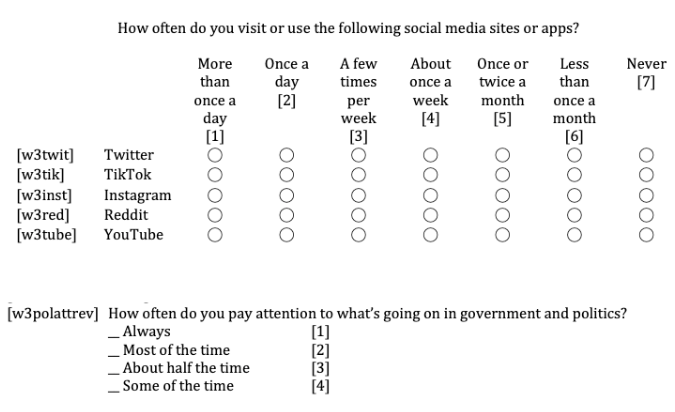

# Module items  { data-search-exclude }
## Assignment  { data-search-exclude data-readaloud-exclude }
- [Variable composition :lucide-download:](https://docs.google.com/document/d/1s_EYpub23bto-wPLykkY-W7BLNj8sfJ2/edit?usp=sharing&ouid=100179871492576617561&rtpof=true&sd=true){ .md-button .md-button--primary target="_blank" rel="noopener" }
    - See: [[How to submit an assignment]]

## Sample assignment  { data-search-exclude data-readaloud-exclude }
- [Sample Variable composition :lucide-download:](https://docs.google.com/document/d/1QXUYfbbFkgYnY1_Jj93E3JcxCKZsmxGY?rtpof=true&usp=drive_fs){ .md-button .md-button--primary target="_blank" rel="noopener" }

## Reading  { data-search-exclude data-readaloud-exclude }
<div class="grid cards" markdown>
:lucide-book-open:  
[Balnaves, Mark, and Peter Caputi. 2001. “Defining the Inquiry.” Pp. 33–62 in Introduction to quantitative research methods: An investigative approach. London: Sage.](https://drive.google.com/open?id=1xHIVakPkwJSDwpoU-wzwrW8dTZr115JR&usp=drive_fs){target="_blank" rel="noopener"}
</div>

<!-- slide-break -->
## Learning outcomes { data-search-exclude }
1. Learn the differences between empirical and normative social research
2. Learn variables:
    1. Demographic and contextual variables
    2. Factor and outcome variables
3. Learn the importance of variables in different data types
    1. Primary data
    2. Secondary data
4. Identify the iterative process: Aligning literature and data
5. Learn how to write:
    1. Variables
    2. Hypotheses
    3. Research questions

<!-- slide-break -->
# [[Social research]]
- Social research examines the society.
    - Depending on whether values (what it should be) or trends/patterns (what it is) are examined, we distinguish between [[normative social research]] and [[empirical social research]].

## [[Normative social research]]
- Normative social research (values):
    - Studies what it should be.
        - It evaluates the social world based on values, beliefs, and ethical standards.
    - "Is it morally right for the state to execute criminals?" (Debated by ethics)
    - We do not need any kind of data in normative social research.

<!-- slide-break -->
## [[Empirical social research]]
- Empirical social research (trends/patterns):
    - Studies what is. It describes and explains the social world as it exists using verifiable evidence.
    - "Does the death penalty deter crime rates?" (Measured by statistics)
    - We collect data or use existing data in empirical social research.
- Empirical social research uses data to examine potential relationships between social concepts, such as;
    - How experienced discrimination affects a sense of belonging.
    - How the frequency of social media use affects attention span.
    - How the perception of similarity affects the quality of friendships.
    - How progressive political attitude affects environmentalist attitudes.
- In research, these social concepts are called “variables.”
- To study the potential relationships between variables, we must have data that specifically includes those variables.
    - It’s because we want to find a justification from the real-world data.

<!-- slide-break -->
# What is [[variable]]?
- A variable is any characteristics, number, or quantity that can be measured, observed, or counted.
    - It represents any piece of information we know about our subjects (e.g., individuals).
<!-- slide-break -->
## [[Content of the variable]]
- Based on the content of the variable, what it asks, there are two types of variables:
    1. **[[Demographic variables]]**
        - Questions about respondents’ demographics are called demographic variables or control variables.
            - age,
            - gender,
            - income,
            - education,
            - race/ethnicity.
    2. **[[Contextual variables]]**
        - Questions about respondents’ attitudes, beliefs, or behaviors, are called contextual variables.
            - religiosity,
            - environmental attitudes,
            - friendship networks,
            - happiness,
            - how safe they feel in their neighborhood.
<!-- slide-break -->
# [[Variables and data types]]
- To be able to use a social concept (variable) in empirical social research, we must have a data that includes those variables:
    - [[Primary data]] (self-collected – surveying and interviewing):
        - If you interview or survey people for a project examining “How frequency of social media use affects attention span,” you must directly ask questions related to “frequency of social media use” and “attention span.”
            - Here you go out and ask questions to people.
    - [[Secondary data]] (collected or created by someone else):
        - If you analyze existing textual data from social media or survey data collected by other researchers for a project examining “How frequency of social media use affects attention span,” that data must actually include information related to “frequency of social media use” and “attention span.”
            - This is a desk-based job, and you do not ask question to people.
<!-- slide-break -->
## Variables in [[primary data]] 
- Primary data is self-collected data obtained directly from people:
    - Data that you collect yourself for a specific purpose.
    - You gather this through interviews (qualitative) or surveys (quantitative) using questions you prepare.
- If you want to study “How frequency of social media use affects attention span,” using primary data, then,
    - You will ask your respondents multiple questions about their social media habits and their reflections on their own attention span.
    - People’s responses become your data.
- You specifically want to study “How frequency of social media use affects attention span,” therefore, you collect your own data by interviewing or surveying people.
<!-- slide-break -->
### Variables in [[primary data]]: Example
- **(1)** You interviewed ([[qualitative research]]) 20 people with the questions you prepared.
- **Data**:
    - !!! quote "Interview 4 (transcription)"
        - **You:** …So, you mentioned earlier that you scroll on your phone in bed while trying to fall asleep?
        - **Respondent 4:** Yeah, I know, it’s pointless. I do it every single night. It’s funny…I don’t remember a single thing I read or watch, but somehow it takes up two hours. Then I just feel so exhausted in the morning.
        - **You:** Aside from being tired, have you noticed social media affecting your life in any other way?
        - **Respondent 4:** I can’t concentrate on anything. I can’t even sit through a video longer than two minutes anymore…
- **(2)** You surveyed ([[quantitative research]]) 300 people with the questions you prepared.
    - **Data**:
        - !!! quote "Survey"
            - **Q3:** …What’s your age? (1) 18-24, (2) 25-34, (3) 35+
            - **Q12:** …On a typical day, how many hours do you spend browsing social media platforms)? (1) Less than 1 hour, (2) 1 – 2 hours, (3) 3 – 4 hours, (4) 5 or more hours
            - **Q25:** …Please indicate how much you agree with the following statement: "I find it difficult to focus on a single task (like reading or watching a movie) for more than 30 minutes." (1) Strongly Disagree, (2) Disagree, (3) Neutral, (4) Agree, (5) Strongly Agree
                - |  id | Q3 | Q12 | Q25 |
                  | --: | -: | --: | --: |
                  |   1 |  2 |   4 |   3 |
                  |   2 |  3 |   3 |   4 |
                  |   … |  1 |   4 |   5 |
                  | 300 |  2 |   2 |   5 |

<!-- slide-break -->
## Variables in [[secondary data]]
- Secondary data is already created by someone else:
    - Data that were originally created or collected by someone else for a different purpose.
        - You obtain this through existing surveys, data archives, government records, or posts from social media platforms (e.g., Reddit, YouTube).
- !!! note "The limits of secondary data"
    - Can we study the link between any variables we want using secondary data?
        - No!…
- If you want to study “How frequency of social media use affects attention span,” using secondary data, then,
    - The existing data must already contain information regarding “the frequency of social media use” and “attention span.”
        - You must work with what is available.

<!-- slide-break -->
### Variables in [[secondary data]]: Example
- **(1)** You conduct a content analysis (qualitative research) using Reddit. Although you initially proposed to study “the frequency of social media use,” as you read the text, you realized that information wasn’t there.
    - Instead, the data itself guided you to a new potential study: “How quitting social media affects attention span.”
    - **Data**:
        - !!! quote "Reddit"
            - 
- **(2)** You downloaded an existing survey dataset (quantitative research) collected from 4,394 people. Although the survey included a question about “the frequency of social media use,” it lacked a question about “attention span.”
    - Consequently, you decided to investigate a different potential relationship: “How the frequency of social media use affects political interest.”
    - **Data**:
        - !!! quote "Existing survey"
            - 
                - |   id | Q7 | Q12 |
                  | ---: | -: | --: |
                  |    1 |  1 |   1 |
                  |    2 |  1 |   2 |
                  |    … |  2 |   2 |
                  | 4394 |  3 |   4 |


<!-- slide-break -->
## The feasibility of variables in [[empirical social research]]
- !!! note "The limits of secondary data"
    - Did you just propose a topic, “How frequency of social media use affects attention span” out of nowhere, simply because you wanted to study it?
        - No!...
- You started with an initial broad interest, such as “attention span”
    - You, then read the literature (what others studied before, what others found, proposed theories, and suggestions for future research)
        - You learned that the frequency of social media use appears to be a potential cause.
- Then, to test what you learned from the literature;
    - **[if primary data]** You prepared specific interview or survey questions;
    - **[if secondary data]** You searched social/mass media content (like Reddit or YouTube) or databases (like ICPSR: for existing survey data)
    - **If no data was available**, you modify our research topic based on the literature and data availability.

<!-- slide-break -->
## The iterative process: Aligning [[literature review]] and data
- The “Dialogue” between literature and data:
    - Research is not a straight line; it is a cycle.
    - We never finalize the literature review or the data analysis in isolation.
        - They must “talk to each other.”
            - ```mermaid
            flowchart LR
                subgraph Real_Life["Real Life: Cyclic / Iterative"]
                    L2["Literature"] <--> D2["Data"]
                end

                subgraph Textbook_View["Textbook View: Linear"]
                    L1["Literature"] --> H["Hypothesis"] --> D1["Data"] --> R["Result"]
                end

                Textbook_View ~~~  Real_Life 
            ```
- Modifying what we study is a natural part of empirical research:
    - We keep modifying our variables or data until the literature and the data are aligned
        - Do not finalize your literature review until you have analyzed your data.
        - Do not finalize your data analysis until you have confirmed the literature supports your variables and the proposed causal relationships.

<!-- slide-break -->
## [[Research question]] examples
1. How do family involvement, parental education level, and family income impact the academic performance?
2. How does the frequency of social media use, political interest, and years of schooling affect political participation?
3. What is the impact of discrimination, acculturation stress, and social support on physical health outcomes?

<!-- slide-break -->
# Functions of variables: Factor variable and outcome variable
- A [[variable]]:
    - Depending on the [[functions of the variable]] in the analysis is either:
        - [[Outcome variable]]: the main topic that we investigate. It is the outcome: What is being affected or changed? This is also called the *dependent variable*.
        - [[Factor variable]]: the variable used to explain or understand the outcome variable (main topic). This is also called the *independent variable*.
            - A factor variable is assumed to cause a change in the outcome variable.
- Let's break down the following research question:
    - *How do family involvement, parental education level, and family income impact the academic performance?*
        - What is being affected or changed?
            - Academic performance.
                - This is the **outcome variable**.
        - What changes academic performance?
            - (1) family involvement
            - (2) parental education level
            - (3) family income 
                - These are **factor variables**.
<!-- slide-break -->
- We need to identify, *logically*, which variable plays which role, because this changes everything: Research question, literature review, data analysis, etc.
    - Some variables can function as either a [[factor variable]] or an [[outcome variable]]:
        - For example, we could argue that the level of education increases someone’s income. In this case; 
            - **Education** is the **factor variable**, and
            - **Income** is the **outcome variable**.
        - In another study, we could argue the opposite: income increases someone’s level of education. In this case, 
            - **Income** is the **factor variable**, and 
            - **Education** is the **outcome variable**.
        - These two research examples are completely different because their factor and outcome variables are defined differently.
<!-- slide-break -->
- However, some variables cannot *realistically* be outcome variables:
    - Nothing can change a person’s age.
    - Similarly, variables such as place of birth or ethnicity cannot be outcomes because they are not influenced by other variables in the dataset.
    - These variables can only serve as factor variables because they may influence other outcomes:
        - **Age** → may influence political attitudes, health status, or technology use.
        - **Place of birth** → may influence language ability or cultural preferences.
        - **Ethnicity** → may influence income, occupation, or health outcomes.
<!-- slide-break -->
- !!! info "Note that..."
    - In a study, you should have one outcome variable. Not two.
        - Because you have one main topic.
    - You should have more than one factor variables.
        - Because we can’t explain a social issue through only one factor.

<!-- slide-break -->
## Variable composition: Example
- Imagine you are interested in how ethnic identification, contact level with natives, and discrimination affect return migration.
    - Since the main topic you are studying is “return migration,” this is your outcome variable.
    - Since you argue that return migration is influenced by three factors: ethnic identification, contact level with natives, and discrimination, these are your three factor variables.
- You use four variables in this research question: (1) Return migration, (2) Ethnic identification, (3) Contact level with natives, and (4) Discrimination. Therefore, the data you will use **MUST** have these variables.
    - ```mermaid
    flowchart BT
        F1["<b>(Factor<br/>variable 1)</b><br/><span style='color:darkgreen'><b>Ethnic<br/>identification</b></span>"]
        F2["<b>(Factor<br/>variable 2)</b><br/><span style='color:#004b87'><b>Contact level<br/>with natives</b></span>"]
        F3["<b>(Factor<br/>variable 3)</b><br/><span style='color:#5e239d'><b>Discrimination</b></span>"]
        OV["<b>(Outcome<br/>variable)</b><br/><span style='color:#a15c00'><b>Return migration</b></span>"]

        F1 --> OV
        F2 --> OV
        F3 --> OV
    ```
        - **Outcome variable**: Return migration
        - **Factor variable 1**: Ethnic identification
        - **Factor variable 2**: Contact level with natives
        - **Factor variable 3**: Discrimination
        - **Research question**: To what extent do ethnic identification, contact level with natives, and discrimination influence return migration?

<!-- slide-break -->
## Hypotheses
- To answer a research question, we must formulate [[hypotheses]] and test them using data.
    - Hypotheses are tentative predictions we have about what we are going to discover before we begin the research.
    - They are educated guesses by following the directions of the literature.
        - ```mermaid
        flowchart BT
            F1["<b>(Factor<br/>variable 1)</b><br/><span style='color:darkgreen'><b>Ethnic<br/>identification</b></span>"]
            F2["<b>(Factor<br/>variable 2)</b><br/><span style='color:#004b87'><b>Contact level<br/>with natives</b></span>"]
            F3["<b>(Factor<br/>variable 3)</b><br/><span style='color:#5e239d'><b>Discrimination</b></span>"]
            OV["<b>(Outcome<br/>variable)</b><br/><span style='color:#a15c00'><b>Return migration</b></span>"]

            F1 -->|increases| OV
            F2 -->|decreases| OV
            F3 -->|increases| OV
        ```
        - **Outcome variable**: Return migration
        - **Factor variable 1**: Ethnic identification
            - **Hypothesis 1**: I expect to find that *ethnic identification* (factor variable 1) increases *return migration* (outcome variable).
        - **Factor variable 2**: Contact level with natives
            - **Hypothesis 2**: I expect to find that *contact level with natives* (factor variable 2) decreases *return migration* (outcome variable).
        - **Factor variable 3**: Discrimination
            - I expect to find that *discrimination* (factor variable 3) increases *return migration *(outcome variable).
        - **Research question**: To what extent do *ethnic identification* (factor variable 1), *contact level with natives* (factor variable 2), and *discrimination* (factor variable 3) influence return migration (outcome variable)?

<!-- slide-break -->
## [[Hypotheses]], [[variable|variables]] and direction
- As there are three factor variables, there are three hypotheses.
    - So, we develop a hypothesis for the proposed relationship between each factor variable and the outcome variable.
- Hypotheses MUST include:
    1. A factor variable and the outcome variable, and
    2. How the factor variable influences or changes the outcome variable (in a positive or negative direction).
        1. It cannot be both “increases” and “decreases” or “depends.”
        2. It cannot be both “positively affects” and “negatively affects”.
            1. You need to choose one.
- **Hypothesis 1**: I expect to find that ethnic identification (factor variable 1) increases return migration (Outcome variable)
- **Hypothesis 2**: I expect to find that contact level with natives (factor variable 2) decreases return migration (Outcome variable)
- **Hypothesis 3**: I expect to find that discrimination (factor variable 3) increases return migration (Outcome variable)

<!-- slide-break -->
# [[Phrasing variables]]
- [[Variable|Variables]] are the main elements of [[hypotheses]] where we propose causal relationships;
    - A increases B, A decreases B, A positive affects B, or A negatively affects B.
- Therefore, phrase your variables so they;
    1. are specific and anyone can understand exactly what you mean,
    2. have high and low values - all variables must be able to increase or decrease, or be positively or negatively affected by other variables.
    3. show causality - variables should make sense in a hypothesis. Factor variables must be able to increase (positively affect) or decrease (negatively affect) the outcome variable so it shows causality.
- **Hypothesis 1**: I expect to find that family involvement positively affects academic performance.

<!-- slide-break -->
## Phrasing variables: [[The three-step test]] 
### Step 1: [[The “What about it” test]]
- Step 1: The “What about it?” test (Check for specificity):
    - A variable is not a topic; it is a specific attribute of that topic.
    - The Test: Look at your variable. Does it force you to ask, “What about it?”
        - Example: You write “Social media.”
            - Question: “What about social media? Do you mean the time spent? The platform? The addiction?”
                - Fix: If you have to explain it, rewrite it.
                - For example, “Frequency of Social Media Use.”

<!-- slide-break -->
### Step 2: [[The “Higher or lower” test]]
- Step 2: The “Higher or lower?” test (Check for measurement):
    - A variable must be able to vary (increase, decrease, positively affect(ed), negatively affect(ed)).
    - The Test: Can you meaningfully ask, “Is this variable higher or lower for this person/group?”
        - Example: You write “Social media.”
            - Question: “Is social media higher for youth?”
                - Fix: If it doesn’t make sense, rewrite it.
                - For example, “Level of social media addiction.”

<!-- slide-break -->
### Step 3: [[The “Is there a causality” test]]
- Step 3: The “Is there a causality?” test (Hypothesis fit):
    - Variables must be phrased so it can logically “increase,” “decrease,” “positively affect(ed),” or “negatively affected”
        - (e.g., “I expect to find that X increases Y”).
    - The Test: Put your variables into the hypothesis template and read, “Is there a meaningful causality here?”
        - Hypothesis template: “I expect to find that factorvariable1 (choose one, delete the rest: increases OR decreases OR positively affects OR negatively affects) outcomevariable”
            - Example: You write “I expect to find that attention span decreases social media.”
                - Question: “Is there a meaningful causality here?”
                    - Fix: If it doesn’t make sense, rewrite it.
                    - For example, “I expect to find that using short video-based social media platforms decreases attention span.”

<!-- slide-break -->
## [[Bad variables, Good variables]]
- |  # | Bad variable                                                  | Why?                                                                                                                                                       | Good variable                                                                                                                                             |
  | --: | ------------------------------------------------------------- | ---------------------------------------------------------------------------------------------------------------------------------------------------------- | --------------------------------------------------------------------------------------------------------------------------------------------------------- |
  |  1 | “Political attitudes”                                         | **The nature/direction of the attitude is not specified.** Doesn’t increase or decrease.                                                                   | “Progressive political attitudes” **OR** “Conservative political attitudes”                                                                                   |
  |  2 | “Culture” **OR** “Globalization”                                  | **Too vague.** What about it? Culture/globalization affects everything and is affected by everything.                                                      | “Collectivistic culture” **OR** “Individualistic culture” **OR** “Support for free trade”                                                                         |
  |  3 | “Race” **OR** “Gender” **OR** “Marital status” **OR** “Employment status” | **These are categories.** You cannot say “Race increases X.” You must specify whether you mean identification, presence of a condition, or something else. | “Strength of racial identification” **OR** “Racism” **OR** “Sexism” **OR** “Gender wage gap” **OR** “Being woman” **OR** “Being Black” **OR** “Being married” **OR** “Being employed” |
  |  4 | “Resources” **OR** “Life conditions”                              | **Too broad.** Are we talking about money, friends, time, information, housing, or safety?                                                                 | “Level of household income” **OR** “Size of social support network” **OR** “Quality of housing conditions” **OR** “Perception of neighborhood safety”                 |
  |  5 | “Social relationships”                                        | **No specific attribute.** Everyone has relationships. The variable must measure a specific attribute of those relationships.                              | “Quality of social relationships” **OR** “The number of friends” **OR** “Frequency of social interaction”                                                         |
  |  6 | “Quality of social relationships and the number of friends”   | **Double-barreled.** There are two separate variables here. You need to focus on only one.                                                                 | “Quality of social relationships” **OR** “The number of friends”                                                                                              |
  |  7 | “Education”                                                   | **It is an institution, not a variable.** Do you mean time spent there, degree earned, or quality of the school?                                           | “Years of formal schooling” **OR** “Level of educational attainment”                                                                                          |
  |  8 | “Climate change”                                              | **This is a global issue, not a variable.** You usually measure people’s reactions to it or their knowledge about it.                                      | “Concern about climate change” **OR** “Support for environmental regulations”                                                                                 |
  |  9 | “Crime”                                                       | **Ambiguous.** Does this refer to committing a crime, fearing crime, or being a victim? “Crime” is just a topic.                                           | “Fear of crime” **OR** “Frequency of criminal behavior” **OR** “Risk of victimization”                                                                            |
