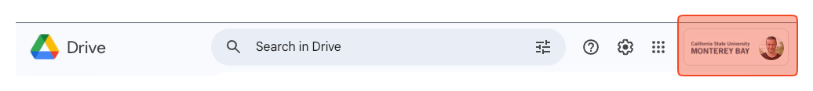
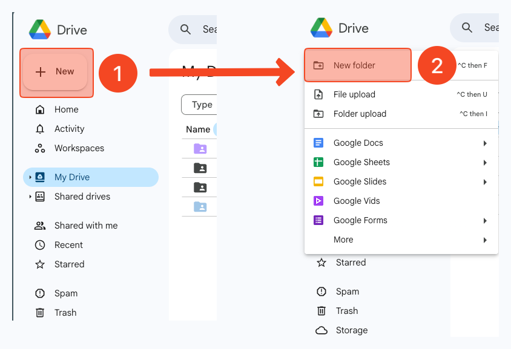
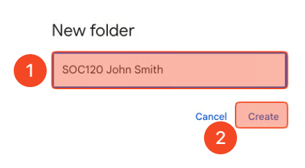
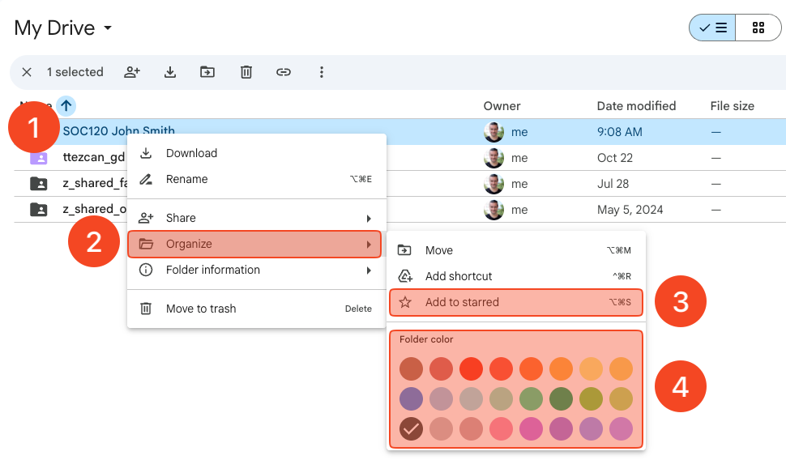
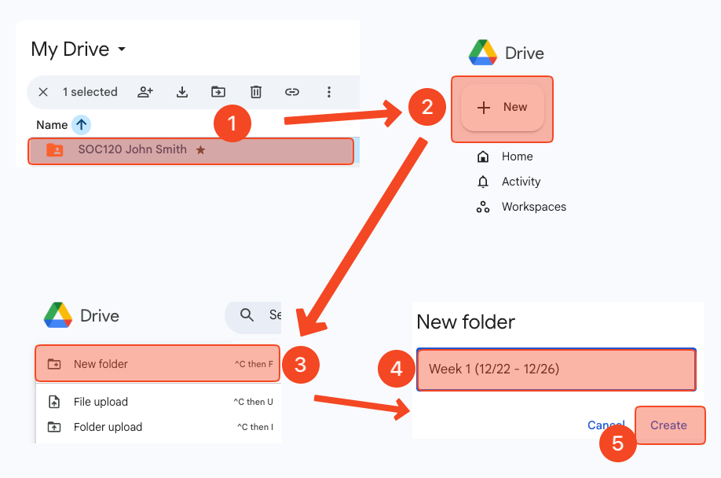
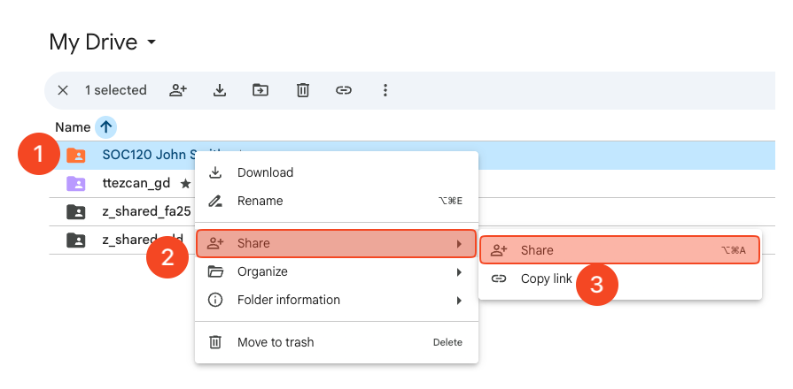
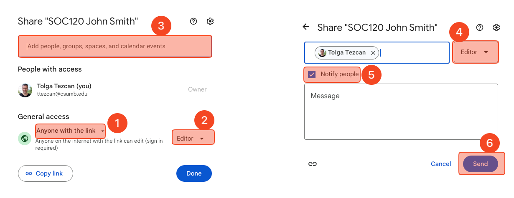
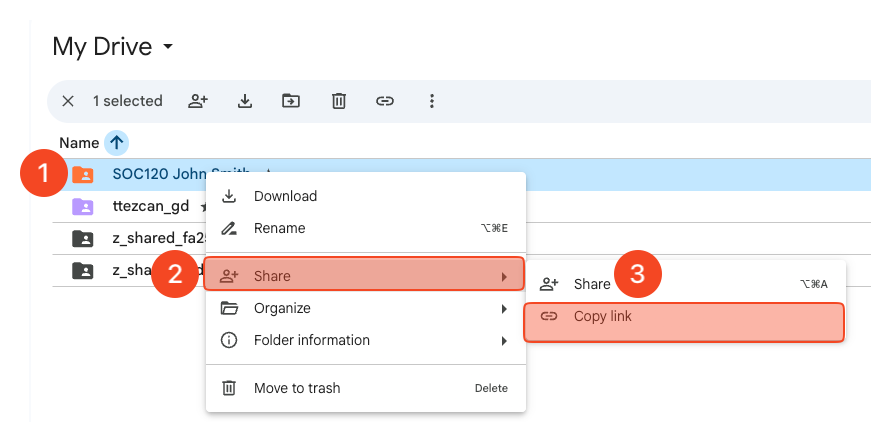
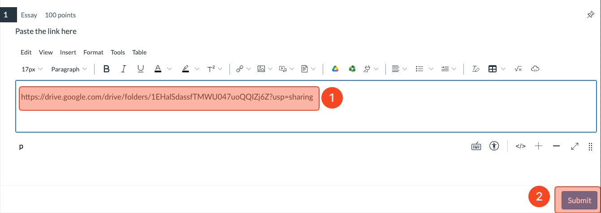

!!! info "Google Drive assignment"
    - Students cannot continue this class without getting at least 70/100 from this assignment (unlimited attempts within the deadline period). 
    - Use [Google Chrome](https://www.google.com/chrome/) or any Chromium based browser ([Brave](https://brave.com/download/), [Opera](https://www.opera.com/download), [Edge](https://explore.microsoft.com/en-us/edge), etc.) for this class.
        - Safari and other browsers **are not fully** compatible with Google Drive and Canvas.
    - We will rely heavily on Google Drive and Google Docs in this course.
        - The purpose of this assignment is to create your Google Drive Class Folder.
        - All your assignment files (except quiz and discussion type submissions) will be stored on Google Drive Class Folder and will be submitted to Canvas from there using Google Drive LTI 1.3).

# Assignment video
- The video below shows how to complete this assignment from start to finish.
- Do not submit this assignment without watching the video and read the instructions together.
    - <iframe src="https://drive.google.com/file/d/10TOV3R0nJsx1lIMmGsuNYlIlD5xTlodb/preview"></iframe>

# Assignment instructions
!!! warning "Repeating students"
    - If you are a repeating student, delete or rename your previous Google Drive class folder, such as "SOC120 John Smith old"

## Creating a folder
- Go to [https://drive.google.com/drive](https://drive.google.com/drive) and make sure you log in with your CSUMB account, **NOT** your personal Gmail account.
    - 

1. On the main page of Google Drive, click “+ New” 
2. Click “New folder.”
    - 

## Naming the folder
1. Type the code of **THIS** class and your name and last name.
    1. For example, “SOC120 Angel Garcia”, “SOC399 John Smith”.
        1. Check [https://csumb.edu/oasis/](https://csumb.edu/oasis/) to see which class you are enrolled in.
        2. No space in the class code. It must be SOC120, **NOT** SOC 120.
        3. DO NOT type the section, such as SOC120-90, SOC399-91.
        4. DO NOT use lower case, such as soc120 or ssci321.
2. Click “Create.”
    - 

## Add to starred and choose a color
1. Right click on the folder you just created. This is your Google Drive class folder.
2. Click “Organize.”
3. Click “Add to Starred.”
4. Right click on the folder you just created again ➜ “Organize” ➜ Choose a color you like under “Folder color.”
    - 

## Creating subfolder for each week
1. Double click on your Google Drive class folder and open it.
2. Click “+ New.”
3. Click “New folder.”
4. Paste the folder names (see below) one by one. Do not type.
    1. Copy:
        1. :fontawesome-brands-windows: &nbsp; ++ctrl+c++
        2. :fontawesome-brands-apple: &nbsp; ++cmd+c++ 
    2. Paste:
        1. :fontawesome-brands-windows: &nbsp; ++ctrl+v++
        2. :fontawesome-brands-apple: &nbsp; ++cmd+v++ 

!!! info "Paste these folder names"
    - Depending on the semester, there are different numbers of weekly folders.
    - You need to repeat this 4 times if you see 4 week names; 8 times if you see 8 week names; 16 times if you see 16 week names below.
        - Week 1 (08/24 - 08/30)
        - Week 2 (08/31 - 09/06)
        - Week 3 (09/07 - 09/13)
        - Week 4 (09/14 - 09/20)
        - Week 5 (09/21 - 09/27)
        - Week 6 (09/28 - 10/04)
        - Week 7 (10/05 - 10/11)
        - Week 8 (10/12 - 10/18)
        - Week 9 (10/19 - 10/25)
        - Week 10 (10/26 - 11/01)
        - Week 11 (11/02 - 11/08)
        - Week 12 (11/09 - 11/15)
        - Week 13 (11/16 - 11/22)
        - Week 14 (11/30 - 12/06)
        - Week 15 (12/07 - 12/13)
        - Week 16 (12/14 - 12/20)

5. Click "Create" after pasting each Week name.
    - 

## Sharing the Google Drive class folder with me
### Click share
1. Right click on the folder you just created one more time
2. Click “Share.”
3. Click “Share” again.
    - 

### Send it
1. Choose “Anyone with the link” under the “General access.” It's "Restricted" by default.
2. Choose "Editor." It's "Viewer" by default.
3. Type my email address:
    1. ttezcan@csumb.edu
4. Make sure you see "Editor."
5. Make sure "Notify people" is checked.
6. Click "Send."
    - 

## Submission to Canvas
### Begin the quiz
- Click on "[gr] Google Drive assignment" under the "Getting ready for the class" heading (Week 1) on Canvas.
- Scroll down and click "Begin."
    1. Right click on your Google Drive class folder.
    2. Click "Share."
    3. Click "Copy link."
        - 

### Paste it
1. Paste (control or cmd + V) the link you copied from the step above.
2. Click "Submit."
    - 