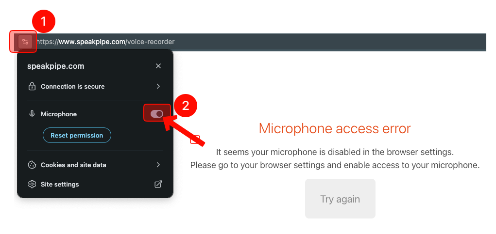
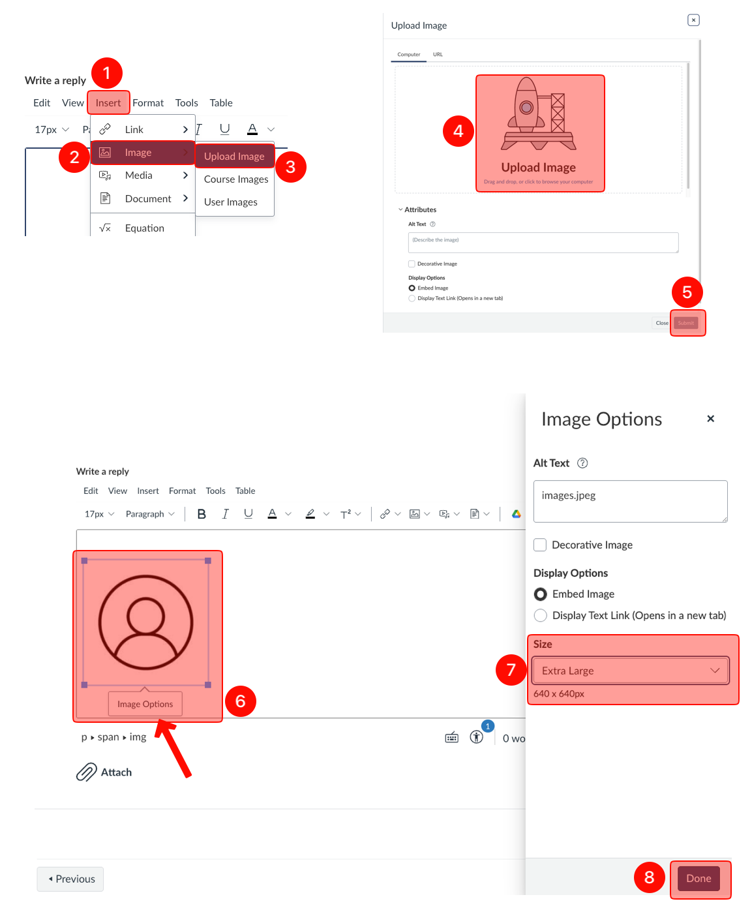

!!! info "There are three parts for this submission:"
    1. Pronunciation of your first and last name
    2. Introduce yourself (200 words minimum)
    3. Your embedded photo

# Instructions
## Pronunciation of your first and last name
- Go to [https://www.speakpipe.com/voice-recorder](https://www.speakpipe.com/voice-recorder)
1. Click "Start recording."
2. Say your preferred first and last name, and click "Stop."
    1. For example, if your name is Kimberly but you go by Kim, just say “Kim” and your last name.
3. Click "Get a link."
4. Click "Get a link" again.
5. Highlight the link and copy.
    1. You will paste this link at the top of "Introduce yourself" assignment.

    - 

- !!! warning "If you get "Microphone access error":"
    1. Click the "settings" on your browser.
    2. Turn "Microphone" on.
        - 
    - Alternatively, you can use your phone or tablet to create a voice link.

## Introduce yourself
- Write a post (minimum **200 words**) where you let the rest of the class know about the following:
1. Your name, (5 points)
    1. How you'd like to be called, if you have a preference (Otherwise, do not state that you do not have a preference),
2. Your major year and minor (if applicable), (5 points)
3. College standing (freshman, sophomore, junior, or senior), (5 points)
4. Any future plans after graduation, such as entering a specific industry, pursuing graduate school, etc., (5 points)
5. Hobbies/interests, (10 points)
6. What kind of classes you have taken so far, especially if they have any link with social research. (10 points)
7. Why you are interested in social sciences. (10 points)

## Embed your photo
- !!! quote "This assignment requires you embed a photo of yourself"
    - Do not attach a photo file. It must be embedded.
    - The purpose is to help us recognize you, so choose a clear photo where your face is visible.
        - Please avoid using Snapchat-style filters (tongue, dog ears, etc.).
        - Make sure your photo is upright and not rotated or upside down.
1. After completing #2 "Introduce yourself" part, click "Insert."
2. Click "Image."
3. Click "Upload Image."
4. Click "Upload Image," choose or drag your photo.
5. Click "Submit."
6. Click on your photo and click "Image Options."
7. Choose "Extra Large."
8. Click "Done," and finally click "Reply."
    - 