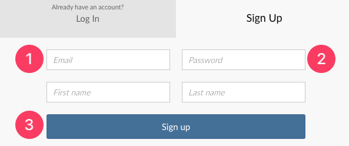
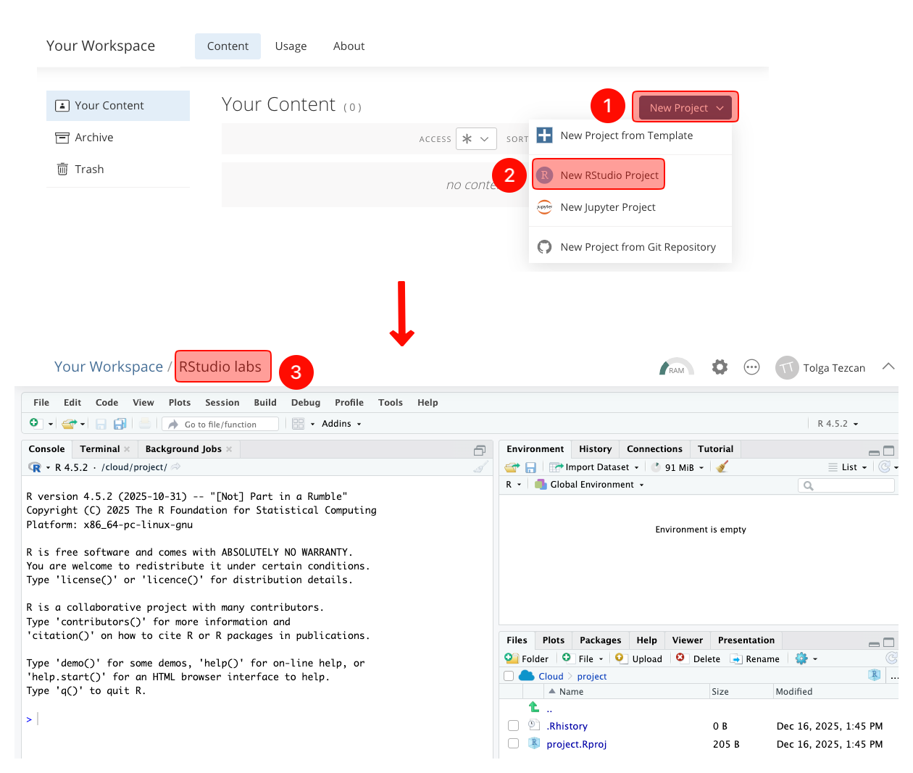
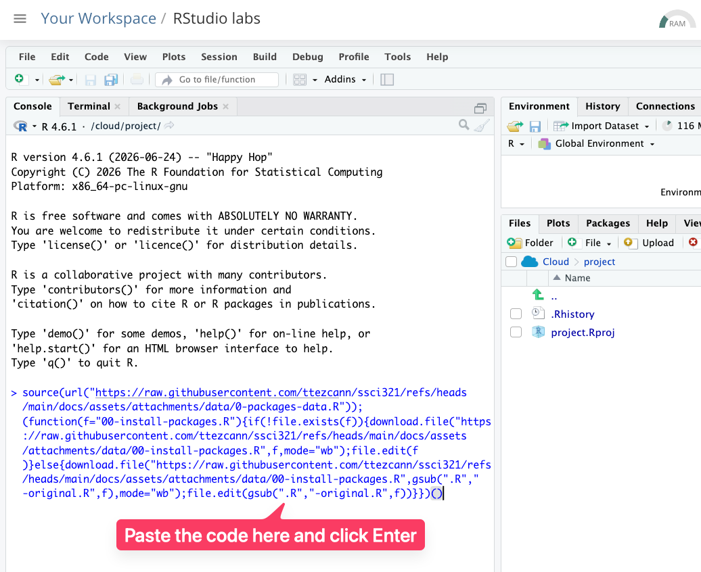
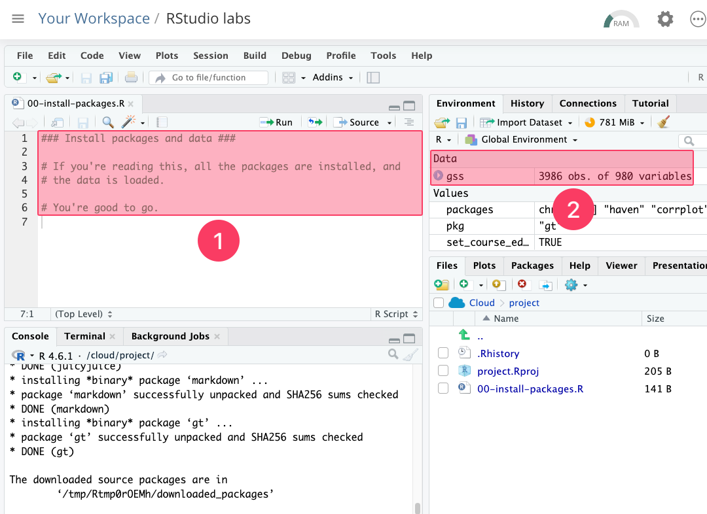
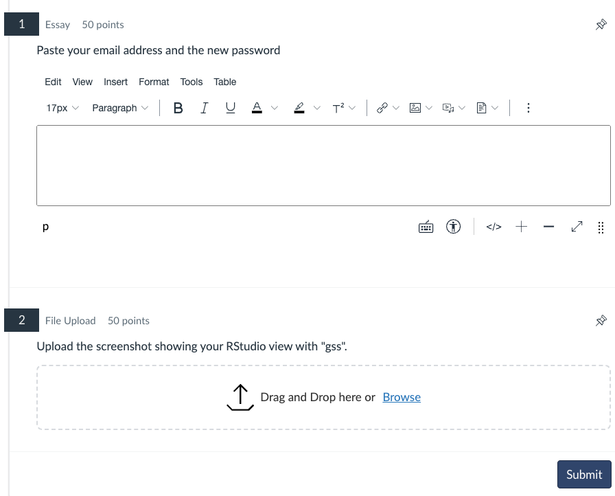

!!! info "RStudio account and packages assignment"
    - Students cannot continue this class without getting full credit from this assignment (unlimited attempts) within the deadline period.
    - This class will teach you how to use RStudio. You will be able to use this software on your browser.
    - You need to have a RStudio (Posit) Cloud account. The new name of RStudio Cloud is Posit. We will use the name of RStudio Cloud and Posit interchangeably.
    - Lab lectures are listed in the syllabus (Table 3: Course schedule), with topics beginning with “RStudio.”

# Assignment video
- The video below shows how to complete this assignment from start to finish.
- Do not submit this assignment without watching the video and read the instructions together.
    - <iframe src="https://drive.google.com/file/d/12QOWU3oj3TJFbRIkpFP-QGBbVM4lsFQ0/preview"></iframe>

# Assignment instructions
## Create a free RStudio Cloud account
### RStudio website
- {width="600"} 
    1. Go to [RStudio website](https://posit.cloud/plans/free) and choose “Free.”
    2. Click "Sign up."
### Email address and a password
- {width="400"}
    1. Put your email address
    2. Put a password (at least 10 characters). You will share your password with me, so note it somewhere down. As you see I will have access to your password. That's why you should not use this password somewhere else. You must:
        1. Use upper and lower case letters
        2. Use numbers
        3. Use special characters
    3. Click "Sign up".
- !!! info "Bitwarden free password generator."
    - I recommend [Bitwarden free password generator](https://bitwarden.com/password-generator/#password-generator).
### Verification
1. Go to your email inbox and click “Verify.”
2. You will be directed to [RStudio website](https://posit.cloud). If not, click on the link.

### New project (RStudio labs)
- {width="700"}
    1. Click "New Project."
    2. Choose "New RStudio Project." 
        1. You will wait 10-15 second while RStudio deploys the project. If it takes longer, refresh your page.
    3. On the new screen, click on “Untitled Project” and type “RStudio labs”.
        - !!! note "RStudio labs project"
            - Many users mistakenly create a separate project for each lab. This is incorrect.  
            - You will not create a new project for each lab.  
            - Instead, you will always work within the existing 'RStudio labs' project throughout the semester.

## Install and load the packages and data
### R Script file code { data-readaloud-exclude }
- :lucide-clipboard-copy: [[Copy the code]] below ➜ Paste into [[RStudio console]] ➜ Hit ++enter++  
    - ```r
    source(url("https://raw.githubusercontent.com/ttezcann/ssci321/refs/heads/main/docs/assets/attachments/data/0-packages-data.R")); 
    (function(f="00-install-packages.R"){if(!file.exists(f)){download.file("https://raw.githubusercontent.com/ttezcann/ssci321/refs/heads/main/docs/assets/attachments/data/00-install-packages.R",f,mode="wb");file.edit(f)}else{download.file("https://raw.githubusercontent.com/ttezcann/ssci321/refs/heads/main/docs/assets/attachments/data/00-install-packages.R",gsub(".R","-original.R",f),mode="wb");file.edit(gsub(".R","-original.R",f))}})()
    ```
        1. On the right side of the code box below, you will see a copy sign :lucide-clipboard-copy:. Click it to copy the code.
        2. Paste it into RStudio console, and click enter.
            - 

## [[Wait]]
- {width="800"}
    1. You will see a ⛔ **STOP** ⛔ sign.
    2. Codes are running in the console. You should wait until the ⛔ **STOP** ⛔ sign disappears and no more code is running.
    3. Just wait, DO NOT click the ⛔ **STOP** ⛔ sign.
    4. When you see the script file opens,
        1. You read "You're good to go", and
        2. "gss" appears under the "Environment - Data section," everything is all set.
        - !!! info "Initial setup"
            The initial setup takes approximately 5–10 minutes; thereafter, it will take only 5 seconds.

## Submission to Canvas
- Click on "[gr] RStudio lab assignment: Account and packages" under the "Getting ready for the class" heading (Week 1) on Canvas.
- There are two questions:
    1. Paste your email address and the new password.
    2. Upload the [[screenshot]] showing your RStudio view with "gss". Your screenshot should look like the image above.
        - 