# [[How to submit an assignment|ref]]
1. Make sure you are signed in and see your CSUMB Google profile on the top right of the assignment file:
    - 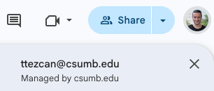
2. Open the assignment file. Click “File” ➜ “Make a copy.”
    - 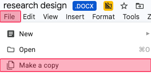
3. Rename the file name.
    - **(1)** Delete the "Copy of" part.
    - **(2)** Add your last name to the beginning of the file name. Do not change the ".docx" part.
        - It must be “your last name and the name of the assignment.docx” 
            - For example, "Smith Research design.docx" (otherwise -5).
                - If there is a mistake, [[How to rename a file in Google Drive|rename the file]].
    - **DO NOT CLICK** “Make a copy" at this screen.
        - **(3)** Click the box under "Folder."
    - 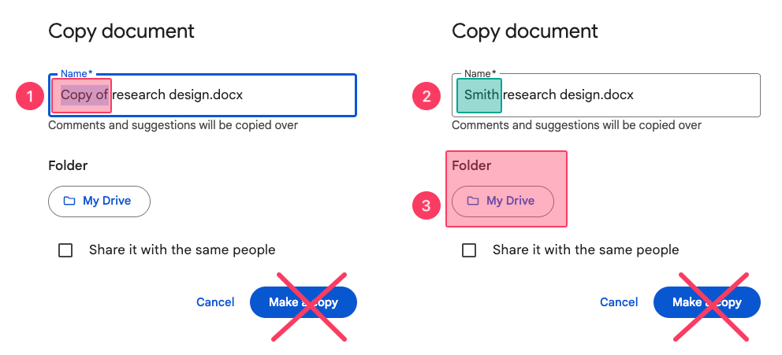
4. After clicking the box under "Folder" in the previous step,
    - **(1)** Click "Starred."
    - **(2)** Find your class Google Drive folder.
    - **(3)** Click the arrow. DO NOT CLICK “Select" at this screen.
    - **(4)** Find the relevant weekly folder.
    - **(5)** Click the arrow. DO NOT CLICK “Select" at this screen.
        - 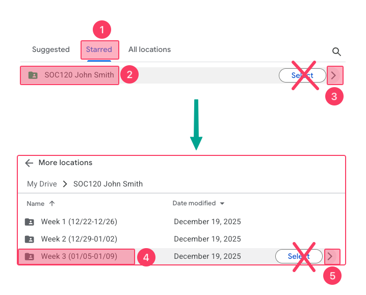
5. Click:
    - **(1)** Select
    - **(2)** Make a copy
    - 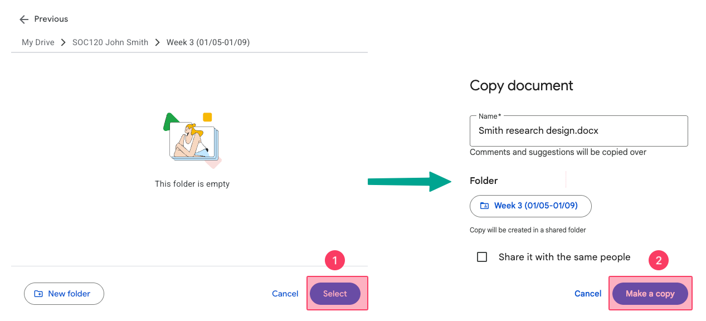
6. Complete the assignment and make sure the file is under the relevant week subfolder.
    - Otherwise, move it [[How to move a file in Google Drive|How to make sure about the correct subfolder and move the file]].
7. Submit it to Canvas
    - **(1)** Click "Start Assignment"
    - **(2)** Choose "Google Drive (LTI 1.3)"
    - **(3)** Sign in with your CSUMB account.
    - **(4)** Choose "My Drive."
    - **(5)** Choose your Google Drive class folder.
    - **(6)** Choose the relevant weekly subfolder.
    - **(7)** Choose the assignment.
    - **(8)** Click "Add."
    - **(9)** Click "Attach."
    - **(10)** Click "Submit Assignment."
    - **(11)** Click "Download" the assignment to make sure you submitted the correct file.
        - If you submitted a wrong file, but the correct file is in the correct weekly subfolder, type “*check Google Drive*” as a comment [[How to post a comment on an assignment]]. There is no resubmission option as a Canvas setting.
    - 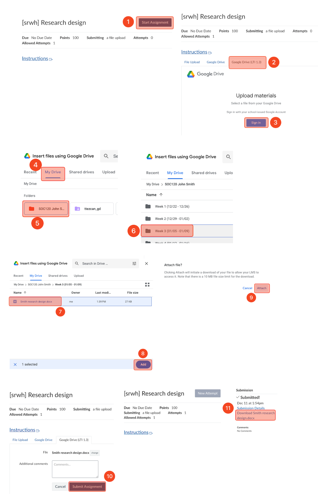

# [[How to move a file in Google Drive|ref]]
- You can use the following instructions for two purposes:
    1. Before submitting a file, always check which folder it is in to avoid losing points.
    2. If the file is in the wrong folder, move it to the correct one.

1. Click on the "move" icon between the star and cloud icons.
2. If the "current location" is correct, you are good to go.
3. If this file needs to be under Week 2, instead of Week 3, find your Google class folder (Starred), double click on the class folder, click on "Week 2."
4. Click  "Move."
    - 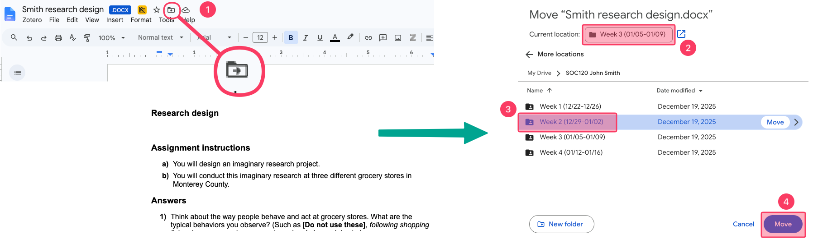

# [[How to rename a file in Google Drive|ref]]
1. Open the file.
2. Highlight the part you want to change and type.
    - 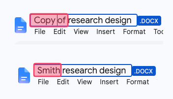

# [[How to rename a folder in Google Drive|ref]]
1. Open and click on the folder.
2. Click "Rename.
3. Type the correct name.
4. Click "OK".
    - 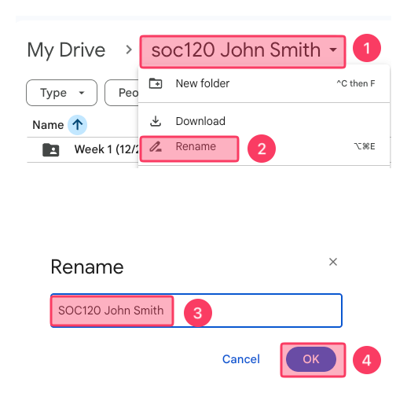

# [[How to post a comment on an assignment|ref]]
1. Go to the assignment page and click "Submission details."
    - 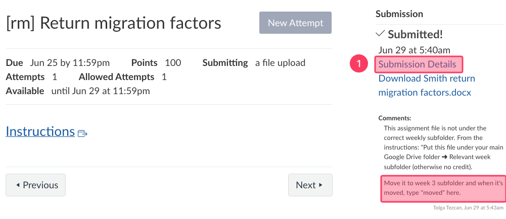
2. Type your comment under  "Add a comment" and click "Save."
    - 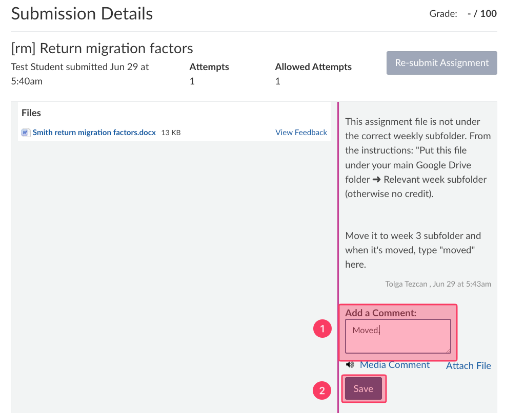