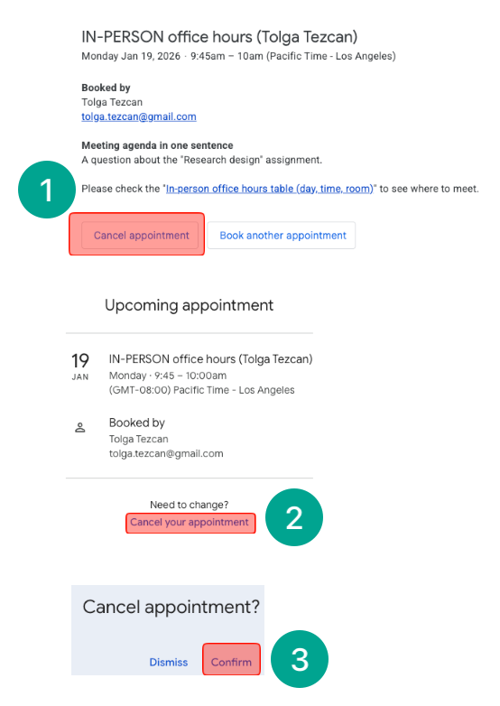

# [[Scheduling an In-PERSON meeting]]
1. Check the day, and time table below.
2. [Click this link to schedule an IN_PERSON meeting](https://calendar.app.google/yLvvKZFGcN2ydt4WA).
3. Choose a 15-min time slot. Book the next time slot if we need more than 15 minutes.
4. Type your first and last name, CSUMB email address, and the meeting agenda in one sentence.
5. Click Book.

# ONLINE office hours table (day and time)
- In-person office hours: before/after classes in a classroom or my office*
- | #  | Day       | Time                            |
  | -- | --------- | ------------------------------- |
  | 1  | Monday    | 9:45 - 10:00 am - (CAHSS 1102)  |
  | 2  | Monday    | 11:15 - 11:30 am - (CAHSS 1102) |
  | 3  | Monday    | 1:45 - 2:00 pm - (CAHSS 1102)   |
  | 4  | Monday    | 3:15 - 3:30 pm - (CAHSS 1102)   |
  | 5  | Monday    | 3:30 - 3:45 pm - (CAHSS 2306)*  |
  | 6  | Monday    | 3:45 - 4:00 pm - (CAHSS 2306)*  |
  | 7  | Monday    | 4:00 - 4:15 pm - CAHSS (2306)*  |
  | 8  | Monday    | 4:15 - 4:30 pm - CAHSS (2306)*  |
  | 9  | Wednesday | 9:45 - 10:00 am - (CAHSS 1102)  |
  | 10 | Wednesday | 11:15 - 11:30 am - (CAHSS 1102) |
  | 11 | Wednesday | 1:45 - 2:00 pm - (CAHSS 1102)   |
  | 12 | Wednesday | 3:15 - 3:30 pm - (CAHSS 1102)   |
  | 13 | Wednesday | 3:30 - 3:45 pm - (CAHSS 2306)*  |
  | 14 | Wednesday | 3:45 - 4:00 pm - (CAHSS 2306)*  |
  | 15 | Wednesday | 4:00 - 4:15 pm - CAHSS (2306)*  |
  | 16 | Wednesday | 4:15 - 4:30 pm - CAHSS (2306)*  |

# Cancelling a meeting
- 
    1. Check your inbox: You received an email for the appointment. Click "Cancel appointment."
    2. Click "Cancel your appointment."
    3. Click "Confirm."