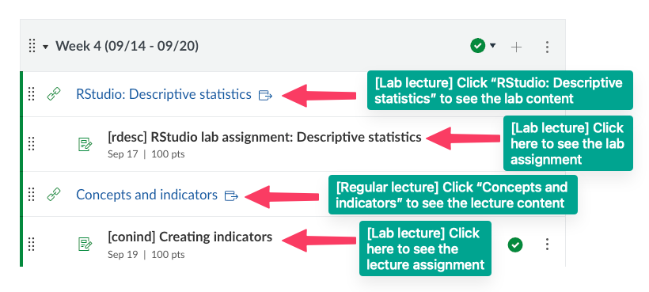
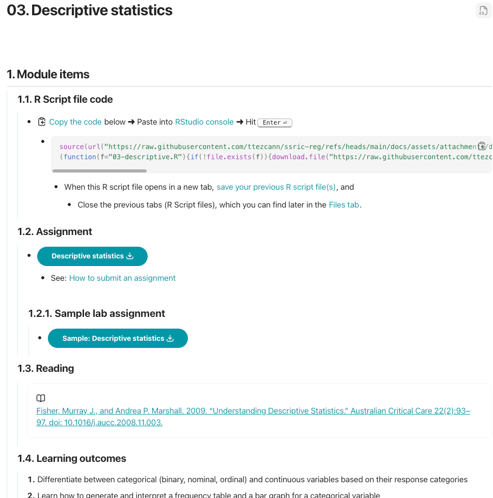
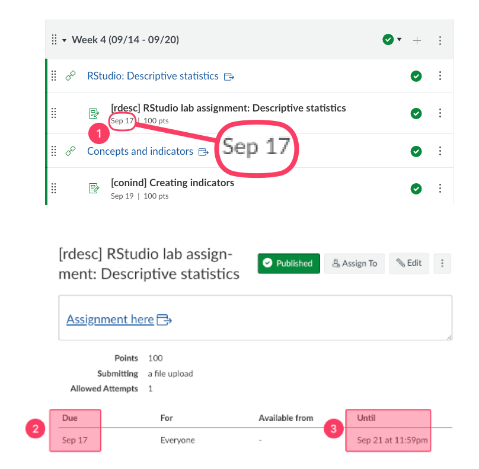

# Class structure
- We have two lectures each week. The first class is lab, the second class is regular lecture. 
- Below is a sample overview, which includes two lectures:
    1. RStudio: Descriptive statistics (lab lecture)
    2. Concepts and indicators (regular lecture)

- Each lecture is accompanied by an assignment (indented items are assignments associated with the specific lecture above):
    - 
## Lecture content
- When you click on the lecture links, you will see the:
    - Assignment,
    - Sample assignment (when relevant),
    - Reading, and
    - The lecture content.
    - **Note**: Lab lectures start with R Script file code that you will run on your RStudio session.
        - 

# [[Due dates]]
1. The Modules page show each assignment's due date.
2. When you click on the assignment, you see more details, such as "Due" again, and
3. "Available until" information:
    1. For this sample assignment, the due date is Sep 17 - 11:59:00pm.
    2. After the deadline has passed, students can submit this assignment by Sep 18 - 11:59:00pm without a deduction (1 day late; no deduction).
    3. If submitted by Sep 19 - 11:59:00pm, the maximum grade could be 90 (2 days late; 10% deduction).
    4. If submitted by Sep 20 - 11:59:00pm, the maximum grade could be 85 (3 days late; 15% deduction).
    5. If submitted by Sep 21 - 11:59:00pm, the maximum grade could be 80 (4 days late; 20% deduction).
    6. Then the submission window closes. Not possible to submit this assignment.
        - 