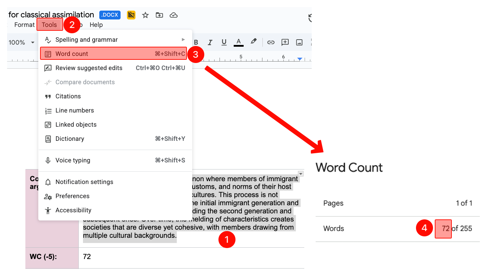

# The policies about reporting word counts
- In most of the assignments, you will be asked to provide a word count of your responses. 
    - If there's a single question, you will target the provided minimum word count. 
    - If there are multiple questions, I will provide the minimum word count with question prompts. 
        - Highlight your responses with the question prompts, and report the word count with question prompts.
        - When there are multiple questions for an essay, the stated minimum word count applies to the collective (combined) responses, not to each question.
    - You can exceed the provided word counts.
- When there is a “WC” (Word count) section under the responses, provide the word count; otherwise, there will be a -5% deduction. 
- Reported word counts must be accurate. Incorrect counts result in a -5% deduction.
    - Discrepancies within ±2% of the actual count are considered negligible and will not be penalized.

# How to report the [[word count]]?
1. Highlight your response.
2. Click "Tools."
3. Click "Word count."
4. See the word count for the highlighted response.
    - 

# General policies about writing
- My primary focus is always on the quality of your critical thinking, the depth of your analysis, and the originality of your ideas as demonstrated in your writing. 
- Your assignments require precise arguments, specific evidence, and concrete examples directly from our course materials and your sociological imagination. 
- Every single word and sentence should serve a function. If removing certain words or sentences would not affect your arguments, then they should be removed. 
- When you are writing, you bring your own experiences, your own voice, and your own unique way of connecting ideas.
- The following will negatively affect your grade:
    1. **Broad, general statements lacking specificity:** Vague claims, unsupported generalizations, or arguments that could apply to any context rather than the specific one presented in specific lectures.
    2. **Overly formal and generic language:** Using sophisticated vocabulary and formal sentence structures, but often in a way that feels detached or lacks personal voice. I do not care about the grammar or word choice. I value your unique thinking over "perfect" academic prose. Assignments are training fields for improving writing skills. Writing improves thinking skills. 
    3. **Lack of original interpretation:** Failing to generate novel insights or truly original arguments.
    4. **Absent or weak authorial stance:** Responses that read like neutral encyclopedia entries, where the analytical position never becomes clear.
    5. **Generic or cliched examples:** Using highly generalized or textbook-perfect examples that lack the specificity or personal touch that comes from genuine engagement with the material.
    6. **Synthetic neutrality:** Providing a perfectly balanced, "encyclopedic" summary of a topic that lacks a distinct, personalized, or sociological stance. If the writing is too "safe" and non-committal, it fails the requirement for original interpretation.
    7. **Predictable or template-based structure:** Prioritizing a rigid, repetitive, or formulaic organization (e.g., most sentences starting and ending with nearly identical structures) over the organic development of a unique personal voice.